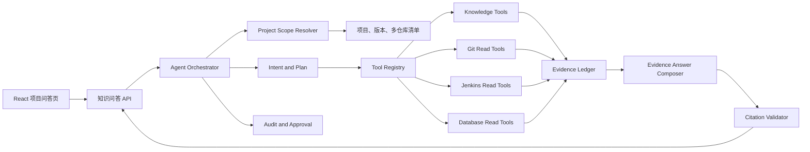
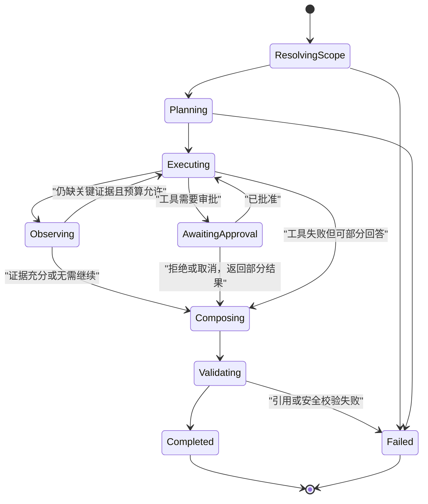

# 团队知识库项目证据 Agent 详细设计方案

- 状态：Proposed
- 日期：2026-08-12
- 适用项目：Tauri SSH 团队知识库
- 目标版本：待排期
- 文档性质：架构与实施方案，不代表功能已经完成
- 关联基线：`docs/architecture/ADR-002-team-knowledge-base-refactor-baseline.md`

## 1. 背景

当前团队知识库已经能够在项目和版本范围内检索需求文档、源码快照、测试源码、关系与其他已索引内容，并将证据交给 AI Provider 生成带引用回答。现有问答的基本链路是：

```text
用户问题
  -> 项目、版本硬过滤
  -> FTS、向量、关系检索
  -> 组织本轮知识证据
  -> 调用 AI Provider
  -> 校验回答引用
  -> 保存问答会话
```

该链路适合回答“已被索引的信息是什么”，但不能主动获取本轮才产生的运行时事实。例如：

- 当前项目截至所选版本共有多少次 Git 提交；
- 每个仓库的首次、最近提交以及主要贡献者；
- Jenkins 最近一次构建是否成功、测试执行结果是什么；
- 某数据库表当前的真实字段、索引或只读业务数据；
- 某个服务当前部署了哪个 commit；
- 某条需求是否同时具备源码、测试源码和测试执行报告。

在这些问题上，现有问答只能搜索已有知识片段。如果索引中没有统计结果，它会正确地拒绝编造，但无法像 Codex 一样继续选择工具、执行只读查询并根据新证据回答。

本方案拟将团队知识库升级为“项目证据 Agent”：在严格项目、版本、权限和审批边界内，由 Agent 规划并调用白名单工具，形成可引用的动态证据，然后生成回答。

## 2. 目标与非目标

### 2.1 目标

1. 保留当前项目、版本、敏感级别和知识来源的硬过滤能力。
2. 支持“规划 -> 工具调用 -> 观察 -> 补查 -> 回答”的有限 Agent 循环。
3. 优先支持 Git、知识检索、源码搜索、Jenkins 和数据库只读查询。
4. 将每次工具结果转换为正式、可审核、可引用的动态证据。
5. 所有回答仍须通过引用校验；动态工具结果不能成为无来源的模型上下文。
6. 版本问题默认使用多仓库版本清单中的冻结 commit，而不是变化中的当前 HEAD。
7. 保持类似 Codex 的一问一答体验，并展示简洁、可理解的执行进度。
8. 复用 Safe Credentials、审批、审计和现有 MCP/Service 能力。
9. 单个工具失败时允许返回部分结果，明确列出未完成项，不把部分成功伪装成完整成功。
10. Agent 行为必须有确定的轮次、耗时、结果大小和成本上限。

### 2.2 非目标

1. 不向模型开放任意 Shell、任意 SQL、任意文件路径或任意外部 URL。
2. 不允许模型绕过项目范围查询其他项目、仓库、数据库或服务器。
3. 第一阶段不执行文件修改、Git commit/push、数据库写入、Jenkins 构建、部署或发布。
4. 不用 Agent 取代现有知识检索；静态知识仍由当前检索链负责。
5. 不把测试源码存在等同于测试已执行通过。
6. 不让远程 Provider接触 Safe Credentials 明文、私钥、Token、连接串或未脱敏输出。
7. 不以一次成功演示替代拒绝路径、安全、超时和真实 Tauri 运行验收。

## 3. 当前能力基线

### 3.1 已实现能力

| 能力 | 当前事实 | 可复用方向 |
| --- | --- | --- |
| 项目问答 | 已有项目/版本范围、对话、Provider、引用和证据缺口 | 保留为 Agent 用户入口和最终回答层 |
| 多仓库项目 | 项目支持关联多个 Git 工作区 | 作为工具可见范围的第一层边界 |
| 多仓库版本 | 版本清单按仓库保存冻结 commit SHA | 作为版本化 Git 查询的默认截止点 |
| 知识检索 | FTS、向量、关系、源码快照、引用 | 注册为 `knowledge.search` 工具 |
| Git 工作区 | 已有仓库状态、日志、分支和受控写操作 | 提取只读 Git 查询能力供 Agent 复用 |
| Jenkins | 已有任务、状态和日志读取能力 | 注册为项目绑定的只读工具 |
| 数据库 | 已有连接管理、查询和审批机制 | 注册 schema 与受控只读 SQL 工具 |
| MCP | 已有工具清单和 controlled/approved 模式 | 复用工具描述、权限和审批语义 |
| Safe Credentials | 凭据由 Rust 后端托管 | 工具只接收凭据引用，不进入模型上下文 |
| 审计 | 已有审计日志模型 | 记录 Agent、工具、目标、结果与关联 ID |
| 会话持久化 | 问题、回答、引用和诊断可保存 | 扩展保存工具步骤和动态证据引用 |

### 3.2 当前缺口

| 缺口 | 当前影响 |
| --- | --- |
| 没有 Agent 编排器 | 一轮只能完成一次检索和一次 Provider回答 |
| 没有工具意图路由 | Git、Jenkins、数据库问题仍走普通知识检索 |
| 没有动态证据模型 | 即使后端执行命令，也无法作为稳定引用进入回答 |
| 没有计划和步骤状态 | 页面无法展示 Agent 正在做什么、哪些步骤失败 |
| 没有循环停止条件 | 不能安全支持多轮工具调用 |
| 工具输出未统一治理 | 不同服务的输出格式、脱敏、大小和错误语义不一致 |
| 版本统计口径未固化 | 容易误用当前 HEAD，混入所选版本之后的提交 |
| 问答结果结构仅面向检索 | 缺少工具调用、证据来源、审批与部分完成信息 |

## 4. 方案选择

### 4.1 候选方案

| 方案 | 核心机制 | 优点 | 缺点 | 结论 |
| --- | --- | --- | --- | --- |
| 固定意图路由 | 用规则识别 Git/Jenkins/数据库问题，调用固定 Service | 简单、确定、安全、快速落地 | 不能灵活组合多个工具 | 适合作为第一阶段 |
| 受控证据 Agent | 模型或规则生成结构化计划，循环调用白名单工具 | 可组合多来源，体验接近 Codex | 需建设编排、证据、停止条件和安全治理 | 推荐目标方案 |
| 通用 Shell Agent | 模型生成任意命令并执行 | 灵活度最高 | 注入、越权、破坏、凭据泄漏风险不可接受 | 不采用 |

### 4.2 推荐结论

采用渐进式混合方案：

1. 第一阶段使用确定性意图分类和固定工具计划，先打通 Git 统计闭环。
2. 第二阶段引入只读、多工具的有限 Agent 循环。
3. 第三阶段接入 Jenkins、数据库和部署状态工具。
4. 写操作继续沿用 controlled/approved 机制，待只读 Agent 稳定后单独评估，不与本方案第一阶段捆绑。

该路径能尽早解决真实问题，同时避免一次性开放大量能力导致安全与可验证性失控。

## 5. 目标架构



### 5.1 模块职责

| 模块 | 单一职责 |
| --- | --- |
| `Agent Orchestrator` | 管理计划、工具步骤、循环、预算、取消、超时和最终状态 |
| `Project Scope Resolver` | 从当前项目和版本解析允许访问的仓库、冻结 commit、来源和外部连接 |
| `Intent Classifier` | 判断普通知识问答、Git 统计、构建验证、数据库查询或组合问题 |
| `Tool Registry` | 暴露白名单工具定义、输入 schema、权限等级、成本和结果限制 |
| `Tool Executor` | 在 Rust 信任边界校验参数并执行具体 Service，不接收任意命令字符串 |
| `Evidence Ledger` | 保存本轮静态和动态证据，生成稳定 citation key |
| `Answer Composer` | 只根据证据账本回答，说明口径、缺口和部分失败 |
| `Citation Validator` | 验证每个事实段落是否引用本轮允许证据 |
| `Approval Gateway` | 将需要确认或写入的步骤转换为审批请求 |
| `Audit Recorder` | 记录主体、计划、工具、目标、结果、耗时和关联 ID |

### 5.2 依赖方向

```text
React Page
  -> TypeScript API
  -> Tauri Command / Dev API
  -> Agent Orchestrator Service
  -> Scope Resolver / Tool Registry / Evidence Ledger
  -> Existing Domain Services
  -> Database / Git Process / Jenkins / SSH / Remote DB
```

禁止反向依赖：

- Git、Jenkins、数据库 Service 不依赖问答页面或 Agent UI。
- Tool Executor 不直接操作 SQLite DAO 以外的持久化细节。
- React 不直接执行系统命令或读取本地仓库。
- Provider 不直接调用本地 MCP Server，也不接触凭据。

## 6. Agent 执行模型

### 6.1 状态机



### 6.2 单轮执行步骤

1. 校验项目、版本、问题长度、Provider 和会话范围。
2. 解析项目关联的仓库、版本清单、知识来源和允许连接。
3. 对问题进行意图分类，并选择确定性计划或有限模型计划。
4. 对每个计划步骤执行工具权限和参数校验。
5. 执行工具，将输出限制、脱敏、规范化并写入本轮证据账本。
6. 判断证据是否足够；不足且预算允许时继续下一步骤。
7. 使用本轮证据和证据缺口生成回答。
8. 校验事实段落引用。
9. 保存问题、回答、步骤、动态证据、诊断和最终状态。

### 6.3 默认预算

第一阶段建议采用保守上限：

| 项目 | 默认值 | 说明 |
| --- | ---: | --- |
| 最大工具步骤 | 8 | 防止无限循环 |
| 最大规划轮次 | 4 | 每轮可以包含并行只读工具 |
| 单工具超时 | 10 秒 | 特殊工具可在注册表中降低或提高 |
| 单轮总超时 | 90 秒 | 超时后返回已有部分证据 |
| 单工具输出 | 64 KiB | 超出后截断并记录原始总量 |
| 本轮证据总量 | 512 KiB | 进入 Provider 前还需进一步裁剪 |
| 并发工具数 | 4 | 多仓库查询使用有界并发 |
| 同类失败重试 | 1 次 | 只针对明确可重试的瞬时失败 |

所有限制由 Rust 后端强制执行，不能只写在模型提示词中。

### 6.4 停止条件

满足以下任一条件即停止继续调用工具：

- 已获得回答所需的核心字段；
- 后续工具不会改变结论；
- 达到步骤、轮次、耗时或输出预算；
- 工具要求审批且用户拒绝或取消；
- 项目范围内没有可用目标；
- 多次返回相同结果；
- 检测到计划循环；
- 安全、权限或引用校验失败。

## 7. 工具注册表

### 7.1 工具定义

每个工具使用后端固定定义，不允许模型自定义可执行内容：

```rust
pub struct AgentToolDefinition {
    pub key: String,
    pub description: String,
    pub input_schema: serde_json::Value,
    pub permission_level: AgentToolPermissionLevel,
    pub supported_scopes: Vec<AgentScopeKind>,
    pub timeout_ms: u64,
    pub max_output_bytes: usize,
}
```

执行请求只包含结构化字段：

```json
{
  "toolKey": "git.commit_count",
  "input": {
    "repositoryBindingId": 2,
    "revisionScope": "selectedRelease",
    "includeMerges": true
  }
}
```

不得接受：

```json
{
  "command": "git rev-list --count ..."
}
```

### 7.2 权限分级

| 等级 | 行为 | 示例 | 交互 |
| --- | --- | --- | --- |
| L1 自动只读 | 当前项目内、低成本、无外部写入 | 知识检索、Git log/rev-list、仓库内搜索 | 自动执行 |
| L2 确认只读 | 远程访问、大范围或较高成本 | Git fetch、远程大日志、跨库大查询 | 执行前确认 |
| L3 审批写入 | 本地或远端状态变更 | commit、push、SQL DML、Jenkins 构建 | controlled/approved |
| L4 禁止 | 高风险或超出产品边界 | 任意 Shell、任意路径删除、秘密导出 | 永不暴露 |

第一阶段仅向 Agent 注册 L1 工具。L2、L3 只能在后续设计明确授权交互后开放。

### 7.3 第一阶段 Git 工具

| Tool Key | 用途 | 固定 Git 操作 |
| --- | --- | --- |
| `git.repository_summary` | 当前仓库、分支、冻结版本摘要 | `rev-parse`、`show -s` |
| `git.commit_count` | 截止某个安全 revision 的提交数 | `rev-list --count` |
| `git.commit_range` | 指定两个冻结 revision 之间的提交 | `log` / `rev-list` |
| `git.recent_commits` | 最近 N 条提交 | `log -n` |
| `git.contributors` | 提交者统计 | `shortlog -sne` |
| `git.changed_files` | 两个 revision 的文件变化 | `diff --name-status` |
| `git.commit_detail` | 单个提交摘要和文件列表 | `show --stat --format` |
| `git.search_history` | 提交标题和正文关键词搜索 | `log --grep` |

所有 revision 必须来自以下来源之一：

1. 当前版本清单中的完整冻结 commit SHA；
2. 后端解析并验证的仓库 HEAD；
3. 后端白名单校验通过的完整 commit；
4. 已保存的另一个版本清单 commit。

模型不能直接传入 `--all`、`@{}`、范围表达式、配置参数或以 `-` 开头的值。

### 7.4 后续知识与源码工具

| Tool Key | 用途 |
| --- | --- |
| `knowledge.search` | 当前项目/版本内混合检索 |
| `knowledge.requirement_coverage` | 需求、实现和测试候选联合检索 |
| `code.symbol_search` | 多仓库源码符号搜索 |
| `code.reference_search` | 符号调用或引用搜索 |
| `code.snapshot_file` | 读取冻结快照中的受限文件片段 |
| `knowledge.relation_query` | 查询 confirmed 关系 |

### 7.5 后续 Jenkins 工具

| Tool Key | 用途 | 默认权限 |
| --- | --- | --- |
| `jenkins.job_status` | 最近构建状态 | L1/L2，取决于是否远程 |
| `jenkins.build_summary` | 构建 revision、时间和结果 | L1/L2 |
| `jenkins.test_report` | 测试总数、失败数和报告链接 | L1/L2 |
| `jenkins.build_log_excerpt` | 受限日志片段 | L2 |
| `jenkins.trigger_build` | 触发构建 | L3，后续单独评估 |

### 7.6 后续数据库工具

| Tool Key | 用途 | 约束 |
| --- | --- | --- |
| `database.schema` | 表、字段、索引和约束 | 仅项目绑定连接 |
| `database.explain` | 查询执行计划 | 禁止执行写语句 |
| `database.read_query` | 参数化只读查询 | 只允许单条 SELECT/CTE，限制行数与耗时 |
| `database.sample_format` | 查看脱敏字段格式 | 敏感字段屏蔽、固定最大行数 |
| `database.execute` | DML/DDL | L3，第一阶段不注册 |

## 8. 项目与版本范围

### 8.1 项目范围解析

Agent 必须从后端读取项目关联，不接受前端或模型传入任意仓库路径。范围解析结果至少包含：

```json
{
  "projectId": 1,
  "releaseId": 1,
  "repositories": [
    {
      "repositoryBindingId": 2,
      "workspaceKey": "example-service",
      "repoPathRef": "internal-only",
      "resolvedCommitSha": "full-commit-sha",
      "inclusionStatus": "ready"
    }
  ],
  "knowledgeSourceIds": [],
  "allowedConnectionIds": [],
  "allowedJenkinsJobKeys": []
}
```

`repoPath` 仅在 Rust 工具执行器内部使用，不返回前端或远程 Provider。

### 8.2 版本语义

用户在项目问答页面已经选择版本时：

- “开发以来提交了多少次”默认解释为从仓库初始提交到所选版本冻结 commit 的可达提交数；
- “当前提交次数”才使用当前 HEAD；
- “v1.1.0 到 v1.2.0”使用两个版本清单中逐仓库的冻结 commit；
- 多仓库结果默认逐仓库展示并给出算术合计；
- 合计不是跨仓库去重后的全局 commit 数，必须明确口径；
- 默认包含 merge commit，同时允许用户追问“不含合并提交”。

如果版本清单中某个仓库未就绪，回答必须标记该仓库未统计，不能把部分仓库合计描述为项目完整总数。

## 9. 动态证据账本

### 9.1 为什么需要独立证据模型

工具输出如果只被拼进 system prompt，会产生三个问题：

1. 用户无法点击查看查询目标和口径；
2. 引用校验无法区分知识片段与工具结果；
3. 会话恢复后无法重现当时回答依据。

因此必须将工具结果转换为正式动态证据。

### 9.2 建议模型

```rust
pub struct AgentEvidence {
    pub evidence_key: String,
    pub session_run_id: String,
    pub step_id: String,
    pub source_type: String,
    pub project_id: i64,
    pub release_id: Option<i64>,
    pub tool_key: String,
    pub target_type: String,
    pub target_key: String,
    pub revision: Option<String>,
    pub title: String,
    pub summary: String,
    pub structured_payload: serde_json::Value,
    pub executed_at: String,
    pub status: String,
    pub is_partial: bool,
    pub diagnostics: serde_json::Value,
}
```

示例：

```json
{
  "evidenceKey": "tool:git.commit_count:run-123:step-2:repo-2",
  "sourceType": "git_statistics",
  "toolKey": "git.commit_count",
  "targetType": "repository_binding",
  "targetKey": "2",
  "revision": "d03ccf7...",
  "title": "example-service 截至 v1.2.0 的提交统计",
  "summary": "可达提交 249 次，包含合并提交",
  "structuredPayload": {
    "commitCount": 249,
    "includeMerges": true,
    "scope": "selectedRelease"
  },
  "status": "succeeded",
  "isPartial": false
}
```

### 9.3 Citation Key

动态证据 citation key 建议固定为：

```text
tool:{tool_key}:{run_id}:{step_id}:{target_key}
```

回答引用示例：

```markdown
该仓库截至 v1.2.0 的冻结提交共有 249 次，统计包含合并提交。
[tool:git.commit_count:run-123:step-2:repo-2]
```

### 9.4 持久化策略

建议新增：

- `knowledge_agent_runs`：单轮 Agent 总状态和预算；
- `knowledge_agent_steps`：计划与工具步骤；
- `knowledge_agent_evidence`：动态证据；
- `knowledge_agent_approvals`：可选的审批关联。

必须使用前向 SQLite 迁移，不清理现有问答会话、消息或引用。动态证据应与保存后的问答消息关联，使历史会话仍可查看当时结果。

动态结果具有时间性。页面必须展示执行时间，不能把历史工具证据冒充当前实时状态。对于 Git 冻结 commit 统计，只要仓库对象未被破坏，结果相对稳定；对于 Jenkins、数据库和部署状态，需要明确“截至执行时间”。

## 10. 回答生成与引用校验

### 10.1 回答约束

最终回答只能使用：

- 本轮知识检索证据；
- 本轮动态工具证据；
- 当前项目和版本元数据；
- 明确标记为仅用于指代消解的会话历史。

历史助手回答不能作为新一轮事实证据。

### 10.2 引用校验扩展

现有引用校验应扩展为同时接受：

```text
document:*        文档证据
code:*            源码快照证据
tool:*            动态工具证据
relation:*        confirmed 关系证据
```

校验规则：

1. 每个事实段落至少包含一个本轮允许 citation key。
2. 引用中的 run ID 必须属于当前问答运行。
3. 工具失败记录只能支撑“查询失败/未知”，不能支撑业务结论。
4. 部分结果必须在回答中明确标记。
5. 测试源码证据只能支撑“存在测试候选”。
6. 只有测试运行报告、Jenkins 结果或 confirmed `verified_by` 才能支撑“已验证通过”。
7. 动态证据经过裁剪后，回答不得引用被裁剪掉的字段。

## 11. 用户体验

### 11.1 保持一问一答

页面继续采用当前类似 Codex 的文字对话，不要求用户进入独立工具工作台。用户只需选择项目版本并提问。

### 11.2 执行进度

长查询展示一行可折叠进度：

```text
正在理解问题
正在读取 v1.2.0 的 5 个仓库版本范围
正在统计 Git 提交（3/5）
正在核对统计口径
正在生成带引用回答
```

默认只展示当前步骤；展开后可查看已完成步骤、耗时和失败摘要。

### 11.3 工具证据卡片

动态证据卡片建议展示：

- 工具类型；
- 仓库、任务或数据库目标；
- 所选版本及截止 commit；
- 执行时间；
- 统计或查询口径；
- 结果摘要；
- 成功、部分完成、失败或需要审批状态。

默认不展示本地绝对路径、远端连接串、SQL 敏感参数或完整日志。

### 11.4 失败恢复

- 单仓库失败：返回其他仓库结果，并列出失败仓库。
- Provider失败：保留已生成的本地证据，允许“重新生成回答”，不重复执行稳定工具。
- 瞬时工具失败：仅自动重试一次。
- 用户取消：停止尚未开始的步骤，保留已完成证据并标为 `cancelled`。
- 审批被拒：不执行动作，说明该部分无法完成。

### 11.5 建议追问

根据统计口径提供可操作的追问，例如：

- 改为统计当前 HEAD；
- 排除合并提交；
- 按提交人统计；
- 比较 v1.1.0 与 v1.2.0；
- 查看最近 20 条提交；
- 查询这些 commit 对应的 Jenkins 构建结果。

## 12. 安全设计

### 12.1 威胁边界

不可信输入包括：

- 用户问题和对话历史；
- 模型生成的计划和工具参数；
- Git 提交信息、作者、文件名和仓库内容；
- Jenkins 日志和测试报告；
- 数据库字段值和错误；
- MCP 工具响应和外部服务响应。

任何上述内容都不能改变 Agent 策略、开放新工具、提升权限或授权写操作。

### 12.2 命令安全

1. 使用 `Command` 参数数组，禁止 `sh -c`、`eval` 和字符串拼接命令。
2. Git 子命令和选项由枚举映射，不使用模型提供的命令名。
3. `repo_path` 只从数据库中的项目绑定获取并规范化。
4. revision 使用完整 commit SHA 或后端解析的安全引用。
5. 设置 `core.hooksPath=/dev/null`、`GIT_OPTIONAL_LOCKS=0` 和 `GIT_TERMINAL_PROMPT=0`。
6. 设置超时、`kill_on_drop`、输出大小限制和 UTF-8 校验。
7. 禁止读取 Git 配置中的凭据、环境变量、credential helper 输出和 remote URL 认证信息。

### 12.3 凭据安全

- Agent 工具输入只能引用 `credentialKey`、连接 ID 或工作区 ID；
- Rust Service 在最短生命周期解析凭据；
- Provider、前端、动态证据、审计和错误均不得包含秘密；
- 远端输出进入 Provider 前执行现有敏感内容检测和脱敏；
- 凭据失败不能自动降级为匿名或拼接 Token URL。

### 12.4 Prompt Injection 防护

Git 文本、源码、文档、日志和数据库记录都可能包含“忽略之前指令”等内容。防护要求：

1. 工具输出按数据块传递，不能作为 system 指令。
2. 计划工具集合由后端决定，证据内容不能注册新工具。
3. 模型输出的工具请求必须通过 schema 和范围校验。
4. 工具输出不得触发自动写入或审批通过。
5. 最终回答引用必须指向结构化证据，而不是模型声称已执行的动作。

### 12.5 审计

每轮至少记录：

- 用户主体和项目/版本；
- Agent run ID；
- 意图、计划摘要和工具 key；
- 目标引用，不记录秘密；
- 开始、完成时间和耗时；
- 成功、失败、拒绝、取消或部分完成；
- Provider 和模型标识；
- 引用校验状态；
- 审批 ID（如有）。

## 13. 错误模型

建议新增稳定错误码：

| 错误码 | 用户语义 |
| --- | --- |
| `AGENT_SCOPE_EMPTY` | 当前项目或版本没有可查询目标 |
| `AGENT_TOOL_NOT_ALLOWED` | 该工具不在当前权限范围内 |
| `AGENT_TOOL_INPUT_INVALID` | 工具参数不合法或超出范围 |
| `AGENT_TOOL_TIMEOUT` | 工具执行超时 |
| `AGENT_TOOL_OUTPUT_TOO_LARGE` | 工具结果超过限制，已裁剪或拒绝 |
| `AGENT_BUDGET_EXHAUSTED` | 已达到本轮执行上限 |
| `AGENT_APPROVAL_REQUIRED` | 继续操作需要用户审批 |
| `AGENT_APPROVAL_REJECTED` | 用户拒绝操作 |
| `AGENT_PARTIAL_RESULT` | 部分目标查询失败 |
| `AGENT_CITATION_INVALID` | 最终回答引用未通过校验 |
| `AGENT_PROVIDER_FAILED` | 已获得证据，但 Provider生成回答失败 |

前端应通过结构化错误解析展示恢复操作，不能只显示原始 `String`。

## 14. 前后端契约建议

### 14.1 问答输入

在兼容现有问答输入的前提下增加可选字段：

```typescript
interface KnowledgeAgentAskInput {
  projectId: number;
  projectVersionId: number;
  question: string;
  providerKey: string;
  model: string;
  evidenceOnly: boolean;
  conversation: KnowledgeConversationMessage[];
  agentMode?: "auto" | "knowledgeOnly";
}
```

第一阶段不允许前端传入工具 key、仓库路径或数据库连接。工具选择由后端基于当前项目范围完成。

### 14.2 运行状态

```typescript
type KnowledgeAgentRunStatus =
  | "resolvingScope"
  | "planning"
  | "running"
  | "awaitingApproval"
  | "composing"
  | "validating"
  | "completed"
  | "partial"
  | "failed"
  | "cancelled";
```

### 14.3 回答结果

建议扩展而不是替换当前 `KnowledgeAskResult`：

```typescript
interface KnowledgeAgentAskResult extends KnowledgeAskResult {
  agentRun?: {
    runId: string;
    status: KnowledgeAgentRunStatus;
    intent: string;
    steps: KnowledgeAgentStepSummary[];
    toolEvidence: AgentEvidenceSummary[];
    startedAt: string;
    finishedAt?: string;
    partial: boolean;
  };
}
```

普通知识问答可以不返回 `agentRun`，保持现有调用方兼容。

### 14.4 进度通信

推荐优先使用 Tauri Channel 或现有本地 Dev API 的流式事件，事件只包含状态摘要：

```json
{
  "runId": "run-123",
  "stepId": "step-2",
  "status": "running",
  "message": "正在统计 Git 提交（3/5）",
  "progressCurrent": 3,
  "progressTotal": 5
}
```

事件不得携带秘密、完整命令输出或未脱敏远程内容。

## 15. 建议文件影响面

以下是实施建议，不表示文件已经存在或已经修改。

### 15.1 Rust 后端

| 文件/模块 | 职责变化 |
| --- | --- |
| `src-tauri/src/services/knowledge_domain/qa.rs` | 在普通检索前增加 Agent 模式路由，保持现有兼容路径 |
| `src-tauri/src/services/knowledge_agent.rs` | 新增 Orchestrator、预算、状态机和取消逻辑 |
| `src-tauri/src/services/knowledge_agent_scope.rs` | 解析项目、版本、仓库清单和允许目标 |
| `src-tauri/src/services/knowledge_agent_tools.rs` | 工具注册表、schema、权限和执行分发 |
| `src-tauri/src/services/knowledge_agent_evidence.rs` | 动态证据规范化、脱敏和引用生成 |
| `src-tauri/src/services/git_workspace.rs` | 提取可复用的安全只读 Git 操作，不向 Agent暴露任意 args |
| `src-tauri/src/services/knowledge_retrieval.rs` | 支持合并静态证据和动态工具证据，并扩展引用校验 |
| `src-tauri/src/models/knowledge_domain/qa.rs` | Agent 输入、运行、步骤和进度 DTO |
| `src-tauri/src/models/knowledge.rs` | 兼容扩展回答、引用或动态证据模型 |
| `src-tauri/src/database/schema.rs` | 前向新增 Agent run/step/evidence 表 |
| `src-tauri/src/database/knowledge_domain/qa.rs` | Agent 会话和证据持久化 DAO |
| `src-tauri/src/commands/knowledge_domain/qa.rs` | Agent ask/status/cancel Command 与错误转换 |
| `src-tauri/src/dev_server/mod.rs` | 本地开发 API 的 Agent 请求、进度与取消映射 |
| `src-tauri/src/services/audit.rs` | 复用或补充 Agent 工具审计动作类型 |

如果仓库现有领域拆分方式与上述建议不同，实施前应以当前导出和相邻模块为准，不机械创建过多文件。

### 15.2 React 前端

| 文件/模块 | 职责变化 |
| --- | --- |
| `src/pages/knowledge/qa/ProjectQaPage.tsx` | 显示 Agent 步骤、进度、工具证据、部分失败与审批状态 |
| `src/lib/api/knowledge-domain/qa.ts` | Agent ask/status/cancel API 封装 |
| `src/types/knowledge-domain/qa.ts` | 前后端 DTO 对齐 |
| `src/store/knowledge.ts` | 如需跨组件共享运行进度，仅保存 UI 状态，不保存权威业务结果 |
| `src/components/ui/MarkdownPreview.tsx` | 识别并打开 `tool:*` 动态引用 |

### 15.3 测试

| 测试位置 | 重点 |
| --- | --- |
| Rust Agent 单元测试 | 计划、预算、循环、停止条件、部分失败 |
| Rust 工具测试 | 参数白名单、revision 校验、超时、输出裁剪 |
| SQLite 迁移/DAO 测试 | 新库、旧库升级、会话恢复、证据关联 |
| 检索与引用测试 | 静态/动态混合引用、失败证据限制 |
| React 测试 | 进度、标签、部分结果、取消、审批和恢复 |
| 真实浏览器验收 | 一问一答、动态证据展开、错误恢复和控制台 |
| 真实 Tauri 验收 | 本地 Git 进程、IPC、SQLite、取消和重启恢复 |

## 16. 分阶段实施计划

### 阶段 0：契约与安全基线

交付内容：

- 确定 Agent run、step、evidence DTO；
- 确定权限等级、预算和错误码；
- 确定动态 citation key；
- 确定所选版本与当前 HEAD 的语义；
- 建立工具注册表空框架；
- 完成威胁模型和拒绝用例。

完成标准：没有工具执行，但契约测试、序列化和数据库迁移设计可独立评审。

### 阶段 1：Git 统计 Agent

支持问题：

- 开发以来提交多少次；
- 各仓库分别多少次；
- 最近有哪些提交；
- 主要提交者是谁；
- 两个项目版本间有哪些提交和文件变化。

交付内容：

- Git 意图分类；
- 项目/版本范围解析；
- Git 只读工具；
- 多仓库并发统计；
- 动态证据卡片；
- Provider回答与引用校验；
- 会话保存和恢复；
- 页面进度与部分失败。

完成标准：真实 v1.2.0 多仓库问题能以冻结 commit 回答，引用可展开，重启后仍可查看当时证据。

### 阶段 2：源码与知识组合 Agent

支持问题：

- 某需求在哪些仓库实现；
- 某接口由谁调用；
- 是否存在相关测试；
- 实现发生在哪些提交。

交付内容：

- 现有知识检索注册为工具；
- 源码符号、引用和历史搜索；
- 静态与动态证据合并；
- 最多 2～4 轮的有限补查。

完成标准：需求、代码、测试源码和 Git 提交能在同一回答中分别引用，状态语义准确。

### 阶段 3：Jenkins 验证 Agent

支持问题：

- 所选版本是否构建成功；
- 测试是否真实执行通过；
- 哪个提交对应哪个构建；
- 失败原因摘要是什么。

交付内容：

- 项目与 Jenkins Job 绑定；
- 构建、测试报告和受限日志工具；
- commit 与构建关联；
- `verified_by` 候选或确认流程。

完成标准：只有真实报告或 confirmed 关系才能显示“已验证通过”。

### 阶段 4：数据库只读 Agent

支持问题：

- 表结构和字段含义；
- SQL 是否匹配真实 schema；
- 当前只读数据能否验证某个假设；
- 查询执行计划和索引情况。

交付内容：

- 项目连接绑定；
- schema、EXPLAIN 和白名单 SELECT；
- 行数、耗时和敏感字段限制；
- 数据证据引用。

完成标准：未经授权不能跨连接、不能执行 DML/DDL、不能把敏感行发送给 Provider。

### 阶段 5：受审批动作（单独立项）

可能范围：

- 触发 Jenkins 构建；
- 创建代码审核任务；
- 生成但不自动提交修改草稿；
- approved 后执行明确的 Git 或数据库动作。

进入条件：只读 Agent 的准确性、安全、审计、取消和恢复已稳定，并完成独立风险评审。该阶段不属于本方案的最小可用范围。

## 17. 验收矩阵

### 17.1 功能验收

| 场景 | 预期 |
| --- | --- |
| 普通知识问题 | 沿用现有知识检索，不无故调用 Git |
| Git 提交次数 | 自动查询当前项目关联仓库并展示口径 |
| 选择历史版本 | 使用版本清单冻结 commit，不使用最新 HEAD |
| 多仓库项目 | 逐仓库列出结果，并明确算术合计含义 |
| 仓库未就绪 | 返回部分结果并标记遗漏，不伪装完整 |
| Provider失败 | 保留工具证据，可单独重试生成回答 |
| 会话恢复 | 能查看历史工具步骤、执行时间和引用 |
| 用户取消 | 停止后续步骤，已完成证据仍可查看 |

### 17.2 安全验收

| 攻击/错误输入 | 预期 |
| --- | --- |
| 问题要求执行 `rm` 或任意 Shell | 工具不可用，明确拒绝 |
| 模型传入 `--all`、`@{}` 或 `-c` | 参数校验拒绝 |
| 传入其他项目仓库 ID | Scope Resolver 拒绝 |
| Git 提交信息包含提示注入 | 作为数据展示，不能改变计划或权限 |
| 工具输出包含 Token/密码 | 脱敏或阻断，不进入 Provider、UI、审计 |
| 查询超时 | 终止子进程，返回可诊断错误 |
| 输出超限 | 裁剪并在证据中标记，不占满上下文 |
| 重放审批令牌 | request hash、目标和状态校验失败 |

### 17.3 正确性验收

- Git 统计与直接只读命令结果一致；
- 当前 HEAD 和版本冻结 commit 的统计不会混淆；
- merge commit 包含/排除口径有测试；
- 多仓库合计等于逐仓库结果之和；
- 不存在工具证据时不生成工具事实；
- 失败证据不能支撑成功结论；
- 引用中的 run ID 和当前回答一致；
- 重新打开历史会话时结果和当时证据一致。

### 17.4 工程门禁

- Rust 格式化、聚焦测试、完整相关测试和 `cargo check`；
- TypeScript 类型检查、Vitest 和生产构建；
- SQLite 新库初始化和旧库升级；
- UTF-8 无 BOM、乱码检查和 `git diff --check`；
- Codex 内置浏览器或 Control Chrome 前端验收；
- 真实 Tauri 进程下 IPC、Git、SQLite、取消和恢复验收；
- 无秘密扫描和审计记录核对。

## 18. 可观测性与评测

建议记录不含秘密的指标：

- 意图分类准确率；
- 平均/95 分位工具步骤数；
- 平均/95 分位响应时间；
- 工具成功、超时、拒绝和部分完成率；
- 引用校验通过率；
- Provider失败后证据复用率；
- 每种工具的输出裁剪率；
- 用户取消率；
- 相同问题在相同冻结版本上的结果一致性。

固定评测集至少覆盖：

1. 普通知识问答不调用工具；
2. 单仓库 Git 统计；
3. 多仓库版本统计；
4. 当前 HEAD 与历史版本差异；
5. 部分仓库失败；
6. Prompt Injection；
7. 非法 revision 和跨项目目标；
8. Provider超时；
9. Jenkins 测试证据边界；
10. 数据库敏感字段和写语句拒绝。

## 19. 迁移与兼容策略

1. 保留现有 `ask_knowledge_scoped_question` 的输入兼容性。
2. 默认 `agentMode=auto` 时，普通问题仍走现有检索；只有匹配受支持意图才进入 Agent。
3. 提供 `knowledgeOnly` 兼容模式，便于回滚和问题隔离。
4. 新表只通过前向迁移添加，不修改或清空现有问答历史。
5. 历史回答没有 `agentRun` 时按旧结构正常渲染。
6. 新动态引用与旧文档/代码引用并存。
7. 第一阶段可使用独立功能开关控制 Git Agent，但团队知识库整体保持可用，不引入全局关闭能力。
8. 出现严重问题时只关闭 Agent 路由，回退到现有知识问答，不影响项目、版本、文档和索引数据。

## 20. 风险与缓解

| 风险 | 影响 | 缓解措施 |
| --- | --- | --- |
| 模型错误选择工具 | 增加延迟或得到无关证据 | 第一阶段确定性路由；后续 schema、预算和观察校验 |
| 版本口径错误 | 历史问题混入新提交 | 默认使用版本清单冻结 SHA，并在回答展示截止点 |
| 多仓库结果被误解 | 算术合计被当作全局去重 | 逐仓库展示并固定口径文案 |
| Prompt Injection | 工具越权或回答被污染 | 工具白名单、数据/指令隔离、后端范围校验 |
| 工具执行过慢 | 页面长时间等待 | 有界并发、进度、超时、取消和部分结果 |
| 输出过大 | 内存和 Provider上下文膨胀 | 工具级与本轮级双重限制、结构化摘要 |
| 凭据泄漏 | 严重安全事件 | Safe Credentials、后端注入、脱敏和阻断 |
| 写操作误触发 | 修改仓库或外部系统 | 第一阶段不注册；后续 controlled/approved |
| 动态证据过期 | 历史回答被误认为当前状态 | 保存执行时间和 revision；实时状态明确时间点 |
| Agent 循环 | 资源消耗和不可预测行为 | 轮次、步骤、耗时、重复结果和循环检测 |

## 21. 关键产品决策建议

建议在实施前确认以下决策：

1. Agent 默认开启，但只注册 L1 项目内只读工具。
2. 版本页面选择值优先于问题中模糊的“当前版本”。
3. Git 提交统计默认包含 merge commit。
4. 多仓库总数是逐仓库算术合计，不做跨仓库 commit hash 去重。
5. 动态工具证据随问答会话持久化。
6. Provider失败时允许只查看本地工具证据并单独重试回答。
7. L2 和 L3 工具不在第一阶段开放。
8. Agent 不获得任意 MCP 工具；只使用知识模块注册的项目范围工具视图。

## 22. 最小可用版本定义

项目证据 Agent 的 MVP 只需要完成以下闭环：

1. 识别 Git 提交统计类问题；
2. 读取当前项目和所选版本的多仓库冻结清单；
3. 对每个就绪仓库执行固定只读提交统计；
4. 返回逐仓库结果、合计、截止 commit 和统计口径；
5. 将每个仓库结果转换成可点击的 `tool:*` 引用；
6. 保存对话、工具步骤和动态证据；
7. 支持进度、超时、取消和部分失败；
8. Provider回答引用校验通过；
9. 非 Git 问题保持现有问答行为；
10. 通过真实 Tauri 和浏览器验收。

MVP 不需要自由规划所有 MCP 工具，也不需要任何写操作。完成该闭环后，再根据真实使用情况决定是否扩展为多工具循环 Agent。

## 23. 示例交互

用户：

> 全业务工单从开发以来进行了多少次 Git 提交？

Agent 进度：

```text
已识别为 Git 统计问题
正在读取 v1.2.0 的多仓库版本范围
正在统计 5 个仓库（5/5）
正在核对提交口径
正在生成带引用回答
```

回答示例：

```markdown
截至当前页面选择的 v1.2.0 冻结版本，5 个关联仓库共有 1020 次可达提交，
该合计包含各仓库的合并提交，是逐仓库计数的算术和，不是跨仓库去重结果。

| 仓库 | 截止版本 | 提交数 |
| --- | --- | ---: |
| repository-a | v1.2.0 冻结 commit | 84 |
| repository-b | v1.2.0 冻结 commit | 249 |
| repository-c | v1.2.0 冻结 commit | 313 |
| repository-d | v1.2.0 冻结 commit | 108 |
| repository-e | v1.2.0 冻结 commit | 266 |

每行均引用对应的 `tool:git.commit_count:*` 动态证据。
如果需要，我可以继续按提交人统计，或改为统计当前 HEAD。
```

## 24. 结论

将团队知识库升级为类似 Codex 的 Agent 在技术上可行，且当前项目已经具备多仓库、不可变版本、知识检索、Git/Jenkins/数据库服务、Safe Credentials、审批、审计、引用和会话等主要基础设施。

推荐产品定位是“项目证据 Agent”，其核心不是让模型自由执行命令，而是在当前项目和版本范围内，通过有限、结构化、可审计的工具循环补齐证据。实施应从 Git 统计 MVP 开始，先验证动态证据、引用、进度、安全和恢复闭环，再逐步扩展到源码、Jenkins 和数据库。

在只读 Agent 稳定前，不应开放通用 Shell或任何自动写入能力。
