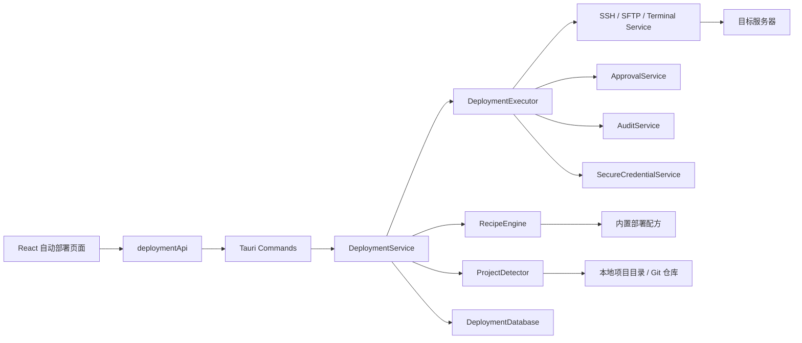

# 服务自动部署功能详细设计方案

**状态**: 规划中
**创建时间**: 2026-06-30
**目标版本**: v0.2 / v0.3
**目标模块**: 运维 / 自动部署 / MCP Server / 审批队列 / 审计日志 / 安全凭证
**参考形态**: Reeve 部署模块、Docker Compose 托管、前端静态站部署、服务凭据代理

---

## 1. 背景与目标

当前应用已经具备服务器资产管理、SSH 终端、SFTP 文件、日志监听、数据库管理、Redis 浏览、资源监控、安全凭证、审批队列、审计日志、AI Skill、Runbook 和 MCP Server。下一步如果要让用户从“连接服务器和管理资源”进一步走到“把服务可靠部署到服务器”，需要新增一个统一的服务自动部署模块。

本模块的目标不是简单执行一段 shell 脚本，而是把部署变成可识别、可预览、可审计、可回滚的一等对象：

- 支持导入本地项目目录或 Git 仓库，自动识别 `Dockerfile`、`docker-compose.yml`、前端项目、Java/Node/Go/Python 服务、静态站点等部署形态。
- 支持预置多种部署方案和环境方案，用户可以直接选择，也可以基于检测结果修改。
- 支持自动生成部署目标、部署组、环境变量、端口、域名、HTTPS、健康检查、回滚策略。
- 支持 Dockerfile 镜像部署、docker-compose 托管部署、前端静态站部署、Node PM2、Java JAR/systemd、自定义脚本等方案。
- 复用现有 SSH/SFTP/数据库/Redis/安全凭证/审批/审计能力，不重新发明凭据和远程执行体系。
- 对 AI/MCP 暴露受控部署工具，让 Agent 能创建计划、发起 dry-run、查看结果，但不能绕过审批或危险命令黑名单。

一句话定位：

> 一个面向桌面运维场景的部署编排中心：从本地项目或 Git 仓库检测出可部署目标，生成可审计部署计划，通过 SSH/SFTP/Docker/Compose 在远程服务器上执行，并提供回滚、日志、健康检查和 MCP 自动化入口。

### 1.1 已确认首版边界

- 菜单位置固定为 `运维 -> 自动部署`。
- 首版目标服务器只支持 Linux。
- Dockerfile 部署支持两种构建模式：远程构建、本地构建镜像后上传；默认远程构建。
- 首版支持域名 HTTPS 自动签证书。
- 首版项目来源同时支持本地项目目录和 Git 仓库拉取部署。
- 首版支持数据库/Redis 专属账号创建自动执行，但必须先进入 dry-run 计划并受审批、审计和危险 SQL/命令策略约束。

---

## 2. 设计原则

### 2.1 Reeve 部署模块可借鉴的能力

参考截图和 Reeve 的部署体验，本模块应吸收以下产品形态：

1. **部署目标与部署组分离**
   单个后端、前端、H5、任务服务是部署目标；多个目标可组合成一个部署组，一键按顺序部署。

2. **新建方案向导**
   用户选择本地项目目录或 Git 仓库、目标服务器后，系统自动探测项目结构，生成多个候选目标卡片。

3. **配方驱动部署**
   `docker-compose`、`static-openresty`、`node-pm2`、`systemd-binary`、`1panel-app`、`custom-script` 等作为可复用配方。

4. **dry-run 预览**
   执行前展示阶段、命令、上传文件、远程目录、端口、域名、影响范围、审批要求。

5. **默认 Docker 优先**
   对后端服务优先使用 Dockerfile / Docker Compose；内存不足时通过 swap、资源限制和 JVM/Node 参数优化，而不是自动改成裸机部署。

6. **前端静态站独立托管**
   前端构建产物作为 artifact 部署到 Nginx/OpenResty，支持同域 API 反向代理和 HTTPS。

7. **服务凭据与共享设施复用**
   MySQL、Redis、PostgreSQL 等不应每个应用重复安装；优先复用已有数据库/Redis 连接并为应用创建专属库、账号和配置。

8. **部署历史可追溯**
   每次部署生成 run 记录、步骤日志、产物摘要、执行人、审批记录、回滚点。

### 2.2 本应用必须坚持的边界

1. 远程执行统一走现有 SSH/SFTP/Terminal Service，不让前端直接拼命令。
2. 凭据统一走安全凭证或服务器凭据保险库，不在部署日志、审计日志、前端状态中输出明文。
3. 部署执行必须经过 dry-run；高风险步骤进入审批队列。
4. 危险命令黑名单对所有部署配方生效，包含 AI 放行模式。
5. 所有部署动作写审计日志。
6. MCP 工具只能触发受控部署能力，不能拿服务器密码、数据库密码、Git Token 或私钥。
7. 远程目录默认进入应用自己的托管根目录，避免污染系统目录。
8. 支持用户自定义，但自定义命令必须进入策略检测和审批。

---

## 3. 方案对比

### 3.1 方案 A：脚本库方式

用户维护部署脚本，应用只负责上传并执行。

优点：

- 实现最快。
- 用户自由度高。
- 对任意项目都能兜底。

缺点：

- 无法结构化识别部署目标。
- 很难做可视化 dry-run、回滚和健康检查。
- 风险控制弱，容易退化成远程 shell 执行器。
- MCP 工具无法安全理解部署影响范围。

结论：只作为 `custom-script` 兜底配方，不作为主方案。

### 3.2 方案 B：配方驱动 + 自动检测

应用扫描本地项目，识别 Dockerfile、Compose、前端、Java、Node 等结构，生成结构化部署目标，再由内置配方执行。

优点：

- 可自动识别常见项目，用户配置成本低。
- 每个配方都有明确输入、输出、dry-run、执行、回滚和健康检查。
- 容易接入审批、审计、MCP 和 AI 辅助。
- 可以逐步扩展更多框架和部署方式。

缺点：

- 首版需要建立检测器、配方引擎、部署运行记录。
- 对复杂项目仍需要人工修正。

结论：首版推荐方案。

### 3.3 方案 C：完整 PaaS/CI/CD 平台

内置构建队列、镜像仓库、流水线、环境管理、发布审批、蓝绿/金丝雀等完整能力。

优点：

- 长期能力强。
- 适合团队化、多环境、多应用部署。

缺点：

- 超出桌面运维工具首版范围。
- 需要大量后台服务和多租户权限设计。
- 与当前单机 Tauri 应用形态不匹配。

结论：作为 v0.4+ 演进方向，不作为首版。

### 3.4 推荐结论

首版采用 **方案 B：配方驱动 + 自动检测**。

实现策略：

1. 新增 `自动部署` 模块，提供部署目标、部署组、模板、运行记录和环境方案。
2. 通过本地项目目录扫描或 Git 仓库 checkout 生成候选部署目标。
3. 使用内置配方执行部署，配方定义固定阶段和策略。
4. 每次执行先生成 dry-run 计划，用户确认或审批通过后再执行。
5. 部署产物、配置、日志、健康检查、回滚点全部结构化保存。

---

## 4. 功能范围

### 4.1 v0.2 首版必做

#### 项目导入与检测

- 选择本地项目目录，或配置 Git 仓库来源。
- 配置 Git 仓库来源：
  - GitHub / GitLab / GitCode / Gitee / 自定义 Git URL。
  - 支持分支、Tag、Commit SHA 选择。
  - 支持使用安全凭证中的 Git Token / SSH Key 创建短期拉取会话，不向前端和 MCP 返回明文凭据。
  - 支持拉取到本机临时工作目录后检测，或在目标 Linux 服务器上拉取后部署。
- 自动扫描根目录和一级/二级子目录。
- 自动识别：
  - `Dockerfile`
  - `docker-compose.yml` / `compose.yml`
  - `package.json`
  - `pnpm-lock.yaml` / `package-lock.json` / `yarn.lock`
  - `vite.config.*` / `vue.config.*` / `nuxt.config.*` / `next.config.*`
  - `pom.xml` / `build.gradle`
  - `go.mod`
  - `requirements.txt` / `pyproject.toml`
  - `nginx.conf` / `Caddyfile`
  - `.env` / `.env.example`
- 自动提取：
  - 应用名、模块名、端口、构建命令、启动命令、输出目录。
  - Compose service 名称、端口映射、volume、env_file、build context、image。
  - Dockerfile 的 `FROM`、`EXPOSE`、`WORKDIR`、`CMD`、`ENTRYPOINT`。

#### 部署目标

- 新建、编辑、删除、禁用部署目标。
- 目标服务器首版只允许选择 Linux 服务器；Windows/macOS 目标服务器仅在 UI 中提示后续版本支持。
- 支持部署目标类型：
  - Dockerfile 镜像服务
  - Docker Compose 栈
  - 前端静态站
  - Node PM2 服务
  - Java JAR/systemd 服务
  - Go/二进制 systemd 服务
  - 自定义脚本
- 部署目标字段：
  - 目标 Key、显示名称、目标服务器、部署根目录。
  - 项目来源类型：本地目录 / Git 仓库。
  - Git 仓库 URL、分支/Tag/Commit、凭证引用、拉取策略。
  - 配方类型、工作目录、构建命令、产物目录。
  - 端口、域名、HTTPS、健康检查 URL。
  - 环境变量、密钥引用、文件映射、前置/后置脚本。
  - 回滚保留数量、超时时间、审批策略。
  - Dockerfile 构建模式：远程构建 / 本地构建镜像后上传；默认远程构建。

#### 部署组

- 新建、编辑、删除部署组。
- 一个部署组包含多个部署目标。
- 支持目标排序和启停勾选。
- 支持一键部署组。
- 支持前后端组合，例如：
  - 后端 Dockerfile 服务
  - 前端 static-openresty
  - H5 static-openresty
  - 后台任务 systemd

#### 内置部署配方

首批预置：

| 配方 | 场景 | 说明 |
| --- | --- | --- |
| `dockerfile-service` | 单服务 Dockerfile | 本地/远程构建镜像，远程 Docker run 或 Compose 托管 |
| `docker-compose` | Compose 栈 | 识别 compose 文件，托管到部署根目录执行 |
| `static-openresty` | 前端静态站 | 构建 dist，上传静态资源，生成反向代理配置 |
| `static-nginx` | 简单静态站 | 仅静态资源托管，不接管复杂站点 |
| `node-pm2` | Node 后端 | 上传 release，安装依赖，pm2 reload |
| `systemd-binary` | Java/Go/二进制 | 上传 artifact，生成 systemd unit，reload/restart |
| `custom-script` | 兜底 | 用户自定义阶段命令，强制 dry-run 和审批 |

#### 环境方案

预置环境方案：

| 环境方案 | 目标 | 主要检查/安装 |
| --- | --- | --- |
| `docker-runtime` | Docker 部署 | Docker、Compose、镜像构建、容器网络、磁盘空间 |
| `static-web` | 前端静态站 | Nginx/OpenResty、站点目录、反代、HTTPS |
| `git-source` | Git 拉取部署 | Git 可用性、凭证引用、分支/Tag/Commit、目标目录权限 |
| `node-runtime` | Node 服务 | Node、pnpm/npm/yarn、PM2、端口 |
| `java-runtime` | Java 服务 | JDK、Maven/Gradle、systemd、JVM 参数 |
| `database-shared` | 数据库复用 | MySQL/PostgreSQL 连接、自动建库、自动创建专属账号 |
| `redis-shared` | Redis 复用 | Redis 连接、密码引用、DB 选择、专属账号/ACL 策略 |
| `tls-domain` | 域名 HTTPS | 域名解析、80/443 连通性、自动签证书、续期策略 |

#### Dry-run 与执行

- 每次部署必须先 dry-run。
- dry-run 展示：
  - 远程环境探测结果。
  - 将执行的阶段和命令。
  - 上传文件清单和大小。
  - Git 拉取来源、分支/Tag/Commit 和目标 checkout 路径。
  - 远程目录变更。
  - 端口/域名/HTTPS 影响。
  - HTTPS 证书签发方式、证书落盘路径和续期方式。
  - 数据库/Redis 专属库、账号、权限和初始化 SQL/ACL 摘要。
  - 需要审批的步骤。
  - 可回滚点。
- 执行时按阶段展示实时日志。
- 支持取消后续步骤。
- 失败后保留现场和日志。

#### 回滚

- 每次成功部署生成 release 目录或 Compose 版本目录。
- 保留最近 N 个版本。
- 支持回滚到上一版本。
- Compose 栈支持回滚 compose 文件、env 文件和镜像 tag。
- 静态站支持 current 软链接回滚。
- systemd/pm2 支持 artifact 回滚后重启。

#### 审计与审批

- 创建/编辑/删除部署目标写审计。
- dry-run 写摘要审计。
- 执行部署写完整审计。
- 每个步骤记录耗时、结果、退出码。
- 以下动作需要审批：
  - 安装 Docker/Nginx/JDK/Node。
  - 修改 systemd unit。
  - 开放防火墙端口。
  - 修改 Nginx/OpenResty 站点配置。
  - 删除远程目录或旧版本。
  - 执行自定义脚本。

### 4.2 v0.3 增强

- AI 自动生成部署方案。
- 镜像仓库推送。
- 蓝绿发布、灰度发布、健康检查自动回滚。
- 多服务器并行部署。
- 环境变量差异对比。
- 产物签名校验。
- 发布审批流模板。
- 部署报告 Markdown/HTML 导出。
- Git 高级能力：子模块、稀疏检出、多仓组合发布、发布分支保护检查。
- MCP 工具完整开放。

### 4.3 暂不做

- 不做完整 CI 系统替代 Jenkins/GitHub Actions。
- 不做 Kubernetes 首版托管。
- 不做公开公网部署控制面。
- 不直接保存远程 root 密码明文。
- 不允许 AI 绕过审批执行危险命令。

---

## 5. 信息架构与页面设计

### 5.1 菜单位置

建议新增在 `运维` 分类下：

```text
运维
  终端 + AI
  日志监听
  SFTP 文件
  数据库管理
  资源监控
  自动部署
```

如果后续部署能力成为核心模块，可升级为一级菜单 `部署`。

### 5.2 页面结构

`/deployments`

- 顶部：部署概览、刷新、新建方案向导、新建部署目标。
- Tab 或分区：
  - 部署目标
  - 部署组
  - 部署模板
  - 环境方案
  - 运行记录
  - 审计/审批入口

### 5.3 新建方案向导

参考 Reeve 截图，采用 Drawer/Modal 大面板：

1. **选择项目**
   - 项目来源：本地项目目录或 Git 仓库。
   - 本地目录：选择本机项目路径。
   - Git 仓库：填写仓库 URL、分支/Tag/Commit、凭证引用和拉取策略。
   - 目标服务器。
   - 部署组名。
   - 探测按钮。

2. **检测结果**
   - 自动生成候选目标卡片。
   - 每张卡片可启用/禁用。
   - 显示类型标签：`image`、`compose`、`artifact`、`systemd`、`custom`。

3. **目标配置**
   - 目标名、部署根目录、构建命令、端口、域名、HTTPS。
   - Dockerfile 构建模式：远程构建或本地构建镜像后上传。
   - 环境变量和密钥引用。
   - 数据库/Redis 托管或复用策略。

4. **环境检查**
   - Docker/Compose 是否可用。
   - 目标目录权限。
   - 端口占用。
   - 磁盘空间。
   - 域名解析。
   - 80/443 可达性。

5. **创建并 dry-run**
   - 创建部署目标与部署组。
   - 立即生成 dry-run 计划。
   - 用户确认后执行。

### 5.4 部署目标列表

字段：

- 名称
- 类型/配方
- 服务器
- 部署根目录
- 域名/端口
- 最近版本
- 最近状态
- 最近部署时间
- 操作：dry-run、部署、日志、回滚、编辑、删除

### 5.5 运行记录详情

以步骤时间线展示：

- 准备
- 环境探测
- 构建
- 上传
- 写配置
- 启动/重载
- 健康检查
- 清理旧版本
- 审计收尾

每个步骤包含：

- 状态、耗时、命令摘要。
- stdout/stderr 截断预览。
- 远程路径和产物摘要。
- 审批请求链接。

---

## 6. 架构设计

### 6.1 总体架构



### 6.2 后端模块

建议新增：

```text
src-tauri/src/
  commands/deployment.rs
  services/deployment.rs
  services/deployment_detector.rs
  services/deployment_recipe.rs
  services/deployment_executor.rs
  services/deployment_artifact.rs
  database/deployment.rs
```

职责：

| 模块 | 职责 |
| --- | --- |
| `commands/deployment.rs` | IPC 入口，接收前端参数，调用 Service |
| `services/deployment.rs` | 目标/组/运行记录业务编排 |
| `services/deployment_detector.rs` | 扫描本地项目，生成候选部署目标 |
| `services/deployment_recipe.rs` | 内置配方定义、dry-run 计划生成 |
| `services/deployment_executor.rs` | 阶段执行、审批、审计、回滚 |
| `services/deployment_artifact.rs` | 本地构建产物打包、校验、上传 |
| `database/deployment.rs` | SQLite 表访问 |

### 6.3 关键调用链

#### 探测项目

```text
React 选择目录
  -> detect_deployment_project(projectPath)
    -> ProjectDetector 扫描文件
    -> 生成 DeploymentCandidate[]
    -> 返回给前端向导
```

#### 创建目标

```text
用户确认候选目标
  -> upsert_deployment_target()
    -> Service 校验服务器/路径/配方
    -> Database 保存 target
    -> Audit 记录配置变更
```

#### Dry-run

```text
run_deployment_dry_run(targetId/groupId)
  -> EnvironmentProbe 探测远程环境
  -> RecipeEngine 生成阶段计划
  -> PolicyEngine 标注审批/风险
  -> 返回 DeploymentPlan
```

#### 执行部署

```text
execute_deployment(planId)
  -> 创建 deployment_run
  -> 逐步骤执行
  -> 需要审批则创建 approval_request 并等待结果
  -> SFTP 上传 / SSH 执行 / 写配置
  -> 健康检查
  -> 写审计和运行状态
```

---

## 7. 数据模型与表结构

### 7.1 核心实体

#### DeploymentTarget

```ts
interface DeploymentTarget {
  id: number;
  key: string;
  name: string;
  serverAlias: string;
  recipe: string;
  sourceType: "local" | "git";
  projectPath: string;
  gitUrl?: string;
  gitRef?: string;
  gitCredentialKey?: string;
  dockerBuildMode?: "remote" | "local_upload";
  workdir: string;
  deployRoot: string;
  domain?: string;
  httpsEnabled: boolean;
  port?: number;
  healthCheckUrl?: string;
  configJson: string;
  enabled: boolean;
  createdAt: string;
  updatedAt: string;
}
```

#### DeploymentGroup

```ts
interface DeploymentGroup {
  id: number;
  key: string;
  name: string;
  description?: string;
  targetKeys: string[];
  createdAt: string;
  updatedAt: string;
}
```

#### DeploymentRun

```ts
interface DeploymentRun {
  id: number;
  runId: string;
  targetKey?: string;
  groupKey?: string;
  status: "pending" | "running" | "success" | "failed" | "cancelled" | "rolled_back";
  versionLabel?: string;
  startedAt?: string;
  finishedAt?: string;
  summary?: string;
  planJson: string;
  createdBy: string;
}
```

#### DeploymentRunStep

```ts
interface DeploymentRunStep {
  id: number;
  runId: string;
  stepKey: string;
  title: string;
  status: "pending" | "running" | "success" | "failed" | "skipped" | "approval_required";
  commandPreview?: string;
  stdoutPreview?: string;
  stderrPreview?: string;
  startedAt?: string;
  finishedAt?: string;
  exitCode?: number;
  approvalId?: number;
}
```

### 7.2 SQLite 表建议

| 表 | 说明 |
| --- | --- |
| `deployment_targets` | 部署目标 |
| `deployment_groups` | 部署组 |
| `deployment_group_targets` | 组与目标关系及排序 |
| `deployment_templates` | 内置/用户自定义部署配方元数据 |
| `deployment_environment_profiles` | 环境方案 |
| `deployment_runs` | 部署运行记录 |
| `deployment_run_steps` | 部署步骤记录 |
| `deployment_artifacts` | 构建产物与远程 release 路径 |
| `deployment_variables` | 环境变量，密钥只保存引用 |
| `deployment_health_checks` | 健康检查配置与最近结果 |
| `deployment_git_sources` | Git 仓库来源、分支/Tag/Commit 和凭证引用 |
| `deployment_certificates` | 自动签发证书的域名、路径、续期元数据 |
| `deployment_service_accounts` | 自动创建的数据库/Redis 专属账号和凭证引用 |

---

## 8. 项目自动检测设计

### 8.1 检测器输出

```ts
interface DeploymentCandidate {
  key: string;
  name: string;
  recipe: string;
  confidence: number;
  sourceType: "local" | "git";
  workdir: string;
  gitRef?: string;
  buildCommand?: string;
  startCommand?: string;
  artifactDir?: string;
  dockerfile?: string;
  composeFile?: string;
  exposedPorts: number[];
  envFiles: string[];
  detectedFrameworks: string[];
  warnings: string[];
  config: Record<string, unknown>;
}
```

### 8.2 Git 仓库来源识别

Git 仓库来源是首版必做能力，与本地目录使用同一套项目检测器。流程如下：

1. 用户输入仓库 URL、选择凭证、填写分支/Tag/Commit。
2. 后端使用安全凭证创建短期 Git 会话。
3. 将仓库拉取到本机应用缓存目录，目录名包含 target key 和 commit 短 SHA。
4. 对 checkout 后的目录执行本地项目检测。
5. dry-run 中展示仓库、ref、commit、checkout 路径和是否包含未识别的大文件。

执行部署时支持两种拉取策略：

- **本机拉取后上传**：适合前端构建、本地构建 Docker 镜像、需要本地检查源码的场景。
- **目标服务器拉取**：适合服务器网络能访问 Git 仓库、希望减少本机上传量的场景。该模式仍然只传递短期会话/凭证引用，不在命令日志中暴露 Token 或私钥。

首版不做 Git 子模块和稀疏检出，这些作为 v0.3 增强。

### 8.3 Dockerfile 识别

识别规则：

- 文件名：`Dockerfile`、`Dockerfile.*`。
- 读取 `FROM` 判断运行时。
- 读取 `EXPOSE` 作为默认端口。
- 读取 `CMD` / `ENTRYPOINT` 作为启动命令说明。
- 如果同目录有 `pom.xml`、`package.json`、`go.mod`，关联语言栈。

生成候选：

- `dockerfile-service`
- 默认目标名：目录名。
- 默认远程根目录：`/opt/tauri-ssh/stacks/<target_key>`。
- 默认镜像名：`<target_key>:latest`。
- 默认构建模式：远程构建。
- 可选构建模式：本地构建镜像后保存为 tar 包上传，适合目标服务器 CPU/内存较弱或无法访问依赖源的场景。

### 8.4 docker-compose 识别

识别规则：

- 文件名：`docker-compose.yml`、`docker-compose.yaml`、`compose.yml`、`compose.yaml`。
- 建议新增 `serde_yaml` 解析 YAML，而不是字符串截取。
- 提取 service、ports、volumes、environment、env_file、build、image、depends_on。

生成候选：

- `docker-compose`
- 一个 compose 文件对应一个部署目标。
- 如果包含多个 app service，允许拆成多个逻辑目标，但默认作为一个栈托管。

### 8.5 前端项目识别

识别规则：

- `package.json` 包含 `vite`、`vue`、`react`、`nuxt`、`next`、`@dcloudio`。
- scripts 包含 `build`、`build:prod`、`build:h5`、`generate`。
- 常见产物目录：`dist`、`build`、`.output/public`、`unpackage/dist/build/h5`。

生成候选：

- `static-openresty` 或 `static-nginx`。
- 默认构建命令：
  - pnpm-lock 存在：`pnpm install && pnpm run build`
  - package-lock 存在：`npm install && npm run build`
  - yarn.lock 存在：`yarn install && yarn build`
- 支持 API 反代前缀：
  - `/api`
  - 用户自定义前缀
  - 后端端口

### 8.6 Java 项目识别

识别规则：

- `pom.xml` / `build.gradle`。
- 检测 Spring Boot 插件、Maven Wrapper、Gradle Wrapper。
- 若存在 Dockerfile，优先生成 `dockerfile-service`。
- 若无 Dockerfile，生成 `systemd-binary`。

默认命令：

- Maven：`./mvnw clean package -DskipTests` 或 `mvn clean package -DskipTests`。
- Gradle：`./gradlew bootJar` 或 `gradle bootJar`。

### 8.7 Node 后端识别

识别规则：

- `package.json` scripts 包含 `start`、`serve`、`pm2`、`node`、`nest`、`express`。
- 如果存在 Dockerfile，优先 Docker。
- 否则生成 `node-pm2`。

---

## 9. 部署配方设计

### 9.1 配方结构

```ts
interface DeploymentRecipe {
  key: string;
  name: string;
  description: string;
  supportedTargets: string[];
  requiredEnvironmentProfiles: string[];
  inputSchema: Record<string, unknown>;
  stages: DeploymentStage[];
  rollbackStages: DeploymentStage[];
}
```

### 9.2 标准阶段

| 阶段 | 说明 |
| --- | --- |
| `probe` | 探测远程环境 |
| `prepare` | 创建目录、检查权限 |
| `build` | 本地或远程构建 |
| `package` | 打包产物 |
| `upload` | SFTP 上传 |
| `configure` | 写 compose/env/nginx/systemd 配置 |
| `deploy` | docker compose up / pm2 reload / systemctl restart |
| `health_check` | HTTP/TCP/命令检查 |
| `cleanup` | 清理旧版本 |
| `audit` | 写审计摘要 |

### 9.3 Dockerfile 配方

默认流程：

1. 检查远程 Docker/Compose。
2. 根据构建模式选择构建路径：
   - 远程构建：打包构建上下文上传到远程。
   - 本地构建镜像后上传：本地 `docker build`，保存镜像 tar 包并上传远程 `docker load`。
3. 远程构建模式执行 `docker build -t <image>:<version> .`。
4. 生成 Compose 文件托管容器。
5. `docker compose up -d`。
6. 健康检查。
7. 保留旧镜像用于回滚。

配置项：

- imageName
- containerName
- exposedPort
- hostPort
- env
- volumeMounts
- networkMode
- memoryLimit
- restartPolicy
- buildMode

### 9.4 Docker Compose 配方

默认流程：

1. 解析 compose 文件。
2. 标注端口冲突、volume 风险、env 缺失。
3. 将 compose 复制到远程部署根目录。
4. 写 `.env`，密钥使用后端注入，不在日志输出。
5. `docker compose pull` 或 `docker compose build`。
6. `docker compose up -d`。
7. 健康检查。

安全规则：

- 禁止 compose 中出现危险 host mount，例如 `/:/host`，默认 require approval。
- `privileged: true` 必须审批。
- `network_mode: host` 必须提示影响范围。
- 删除 volume 不允许自动执行。

### 9.5 Static OpenResty 配方

默认流程：

1. 本地构建前端。
2. 打包 dist。
3. 上传到远程 release 目录。
4. 更新 `current` 软链接。
5. 生成 OpenResty/Nginx 站点配置。
6. 注入 API 反向代理：
   - `location /api/ -> 127.0.0.1:<backendPort>`
7. 可选 HTTPS。
8. reload OpenResty/Nginx。

回滚：

- 切换 `current` 软链接到上一版本。
- reload Web 服务。

### 9.6 Systemd Binary 配方

默认流程：

1. 本地构建 jar/go/binary。
2. 上传到远程 release 目录。
3. 写 env 文件。
4. 生成 systemd unit。
5. `systemctl daemon-reload`。
6. `systemctl restart <service>`。
7. `systemctl status` 和健康检查。

审批要求：

- 写 `/etc/systemd/system` 必须审批。
- restart 服务必须审批或二次确认。

---

## 10. 环境探测与准备

### 10.1 服务器探测项

- OS、架构、内核。
- CPU/内存/Swap。
- 磁盘空间。
- Docker 版本。
- Compose 版本。
- Nginx/OpenResty 是否存在。
- Node/pnpm/npm/yarn 是否存在。
- JDK/Maven/Gradle 是否存在。
- 端口占用。
- 防火墙状态。
- 当前用户权限。

### 10.2 域名与 HTTPS

- 域名是否解析到目标服务器。
- 80/443 是否可访问。
- 证书签发方式：
  - 首版支持自动签证书。
  - 默认优先通过 OpenResty/Nginx 托管站点签发证书。
  - dry-run 必须展示证书路径、签发邮箱、域名解析状态、80/443 连通性和续期策略。
  - 签证书、写站点配置、reload Web 服务属于高风险步骤，必须进入审批或二次确认。

### 10.3 共享数据库/Redis

- 优先复用数据库管理模块已有连接。
- 数据库密码、Redis 密码走安全凭证引用。
- 首版支持自动创建 app 专属库、app 专属账号和最小权限授权。
- 自动创建前必须在 dry-run 中展示 SQL/ACL 摘要、目标连接、数据库名、账号名、权限范围和回滚策略。
- 执行成功后将专属连接登记为安全凭证或数据库连接凭证，应用部署时只引用凭证 Key。
- Redis 首版优先支持选择 DB 和基于 Redis ACL 的专属账号；目标 Redis 不支持 ACL 时，降级为 DB 隔离并在 dry-run 中提示风险。
- 创建库、创建账号、授权、导入初始化 SQL 都属于高风险步骤，必须审批或二次确认。

---

## 11. 安全、审批与审计

### 11.1 风险分级

| 风险 | 示例 | 处理 |
| --- | --- | --- |
| readonly | 环境探测、端口检测 | 自动执行并审计 |
| review | docker build、上传文件、写应用目录 | 二次确认 |
| high | systemctl restart、写 nginx 配置、开放端口 | 审批队列 |
| blocked | rm -rf /、mkfs、DROP DATABASE、危险黑名单命令 | 直接阻断 |

### 11.2 密钥处理

- 部署变量分为普通变量和密钥变量。
- 密钥变量只保存 `credentialKey` 或 `secretRef`。
- 执行时后端临时注入。
- dry-run 和日志中显示 `******`。
- MCP 返回不包含密钥值。

### 11.3 审计事件

建议事件名：

- `deployment.target.create`
- `deployment.target.update`
- `deployment.target.delete`
- `deployment.detect.project`
- `deployment.dry_run`
- `deployment.run.start`
- `deployment.run.step`
- `deployment.run.success`
- `deployment.run.failed`
- `deployment.rollback`
- `deployment.mcp.call`

---

## 12. MCP 工具规划

首批 MCP 工具只开放受控能力：

| 工具 | 能力 | 风险 |
| --- | --- | --- |
| `deployment_templates_list` | 列出内置配方 | readonly |
| `deployment_targets_list` | 列出部署目标脱敏信息 | readonly |
| `deployment_groups_list` | 列出部署组 | readonly |
| `deployment_runs_list` | 列出运行记录 | readonly |
| `deployment_detect_project` | 扫描本地项目目录或 Git 仓库 checkout 结果 | review |
| `deployment_dry_run` | 生成部署计划 | review |
| `deployment_run` | 执行部署计划 | high / approval |
| `deployment_run_status` | 查询运行状态 | readonly |
| `deployment_run_logs` | 查询步骤日志 | readonly |
| `deployment_rollback_dry_run` | 生成回滚计划 | review |
| `deployment_rollback_run` | 执行回滚 | high / approval |

MCP 约束：

- 不提供任意命令执行。
- 不返回服务器密码、数据库密码、Git Token。
- 执行类工具必须绑定已存在 target/group。
- `deployment_run` 必须基于最近的 dry-run planId。
- high 风险自动创建审批请求。

---

## 13. 前端 API 与 Command 规划

### 13.1 Commands

```rust
detect_deployment_project(input) -> DeploymentDetectionResult
list_deployment_targets(input) -> Vec<DeploymentTarget>
upsert_deployment_target(input) -> DeploymentTarget
delete_deployment_target(key) -> ()
list_deployment_groups() -> Vec<DeploymentGroup>
upsert_deployment_group(input) -> DeploymentGroup
delete_deployment_group(key) -> ()
list_deployment_templates() -> Vec<DeploymentTemplate>
list_deployment_environment_profiles() -> Vec<DeploymentEnvironmentProfile>
create_deployment_dry_run(input) -> DeploymentPlan
execute_deployment_run(input) -> DeploymentRun
list_deployment_runs(input) -> Vec<DeploymentRun>
get_deployment_run_detail(runId) -> DeploymentRunDetail
create_deployment_rollback_dry_run(input) -> DeploymentPlan
execute_deployment_rollback(input) -> DeploymentRun
```

### 13.2 前端 API

```text
src/lib/api/deployment.ts
src/types/deployment.ts
src/pages/deployments/index.tsx
```

---

## 14. 实施阶段

### 第一阶段：基础模型与只读检测

- 新增部署相关类型。
- 新增 SQLite 表和迁移。
- 实现内置模板/环境方案列表。
- 实现本地项目目录和 Git checkout 目录检测器。
- 实现 Git 仓库来源配置、凭证引用和 checkout 后检测。
- 新增 `/deployments` 页面和新建方案向导静态流程。
- 支持 Dockerfile、Compose、前端项目基本识别。

验收：

- 选择项目目录后能生成候选部署目标。
- 输入 Git 仓库、分支/Tag/Commit 和凭证引用后能 checkout 并生成候选部署目标。
- 不执行任何远程命令。
- 页面能保存部署目标和部署组。

### 第二阶段：dry-run 与环境探测

- 实现服务器环境探测。
- 实现 `create_deployment_dry_run`。
- 生成阶段计划、命令预览、审批要求。
- 实现 HTTPS 自动签证书 dry-run。
- 实现数据库/Redis 专属账号创建 dry-run。
- 接入审计日志。

验收：

- 对 Dockerfile/Compose/静态站能生成完整 dry-run。
- dry-run 能展示远程构建/本地构建镜像上传两种 Dockerfile 路径。
- dry-run 能展示证书签发计划和数据库/Redis 专属账号计划。
- 能展示端口冲突、缺少 Docker、磁盘不足等问题。

### 第三阶段：首批真实执行

- 实现 `static-openresty`。
- 实现 `docker-compose`。
- 实现 `dockerfile-service`。
- 实现 Git 拉取部署。
- 实现 HTTPS 自动签证书。
- 实现数据库/Redis 专属账号自动创建。
- 实现运行记录、步骤日志、失败记录。
- 接入审批队列。

验收：

- 能部署一个前端静态站。
- 能部署一个 docker-compose 栈。
- 能部署一个 Dockerfile 服务。
- 能从 Git 仓库拉取项目并完成部署。
- 能为绑定域名自动签发 HTTPS 证书。
- 能创建并登记数据库/Redis 专属账号。
- 所有执行步骤可审计。

### 第四阶段：回滚与部署组

- 实现 current/release 目录结构。
- 实现 Docker/Compose/静态站回滚。
- 实现部署组顺序执行。
- 失败时支持停止后续目标。

验收：

- 可回滚上一版本。
- 部署组能一键部署前后端组合。

### 第五阶段：MCP 与 AI 辅助

- 开放首批 MCP 工具。
- SQL/终端/日志 AI 上下文可引用部署运行记录。
- AI 可生成部署建议和风险解释。
- AI 执行部署必须走 dry-run + 审批。

验收：

- MCP 能列出目标、生成 dry-run、查询运行日志。
- 执行类 MCP 工具不能绕过审批。

---

## 15. 验收标准

### 功能验收

- 能导入包含 Dockerfile 的项目并生成部署目标。
- 能导入 docker-compose 项目并生成 Compose 部署目标。
- 能导入 Git 仓库并按分支/Tag/Commit 生成部署目标。
- 能识别 Vite/Vue/React/Uniapp 前端项目并生成静态站目标。
- 能创建部署组并按顺序执行。
- 能生成 dry-run 计划。
- 能执行至少三类首批配方。
- 能选择 Dockerfile 远程构建或本地构建镜像后上传，默认远程构建。
- 能自动签发 HTTPS 证书。
- 能自动创建数据库/Redis 专属账号并登记凭证引用。
- 能查看部署日志和历史。
- 能执行回滚。
- 能从 MCP 查询部署状态。

### 安全验收

- 部署日志不出现密码、Token、私钥。
- 危险命令黑名单始终生效。
- high 风险步骤进入审批。
- 生产环境不会开放公网控制端口。
- MCP 工具无法执行任意 shell。

### 体验验收

- 向导中的检测结果能解释为什么生成某个目标。
- 用户能手动修正命令、端口、域名、部署根目录。
- dry-run 能让用户清楚知道会发生什么。
- 失败后能看到明确失败阶段和下一步建议。

---

## 16. 关键风险与应对

| 风险 | 影响 | 应对 |
| --- | --- | --- |
| 项目类型识别不准 | 生成错误部署目标 | 显示置信度和检测依据，允许用户手动修改 |
| 自定义脚本风险高 | 可能破坏服务器 | 强制审批、危险命令扫描、默认不自动执行 |
| Docker/Compose 版本差异 | 部署失败 | 环境探测记录版本，配方按版本降级 |
| 大产物上传慢 | 体验差 | 显示进度，支持跳过未变化文件，后续做增量 |
| 远程权限不足 | 部署中断 | dry-run 阶段提前检测目录和 sudo 能力 |
| 密钥泄露 | 高风险 | 全部密钥引用化，日志脱敏 |
| 回滚不完整 | 服务不可用 | 每个配方必须定义 rollbackStages |

---

## 17. 已确认决策

1. 自动部署模块放在 `运维 -> 自动部署`。
2. 首版只支持 Linux 目标服务器。
3. Dockerfile 支持远程构建和本地构建镜像后上传两种方式，默认远程构建。
4. 首版支持域名 HTTPS 自动签证书。
5. 首版同时支持 Git 仓库拉取部署和本地项目目录部署。
6. 首版支持数据库/Redis 专属账号创建自动执行，但必须受 dry-run、审批、审计、危险 SQL/命令策略和凭证脱敏约束。

---

## 18. 推荐首版范围

为了保证可交付，建议 v0.2 首版锁定：

1. 菜单：`运维 -> 自动部署`。
2. 目标服务器：Linux。
3. 项目来源：本地项目目录、Git 仓库。
4. 首批识别：Dockerfile、docker-compose、Vite/Vue/React/Uniapp 前端。
5. 首批配方：`dockerfile-service`、`docker-compose`、`static-openresty`。
6. Dockerfile 构建：远程构建、本地构建镜像后上传；默认远程构建。
7. 必须具备：dry-run、审批、审计、运行记录、基础回滚。
8. 必须具备：域名 HTTPS 自动签证书。
9. 必须具备：数据库/Redis 专属账号自动创建和凭证登记。
10. MCP 首批只做只读和 dry-run，执行类工具在 v0.3 开放。
