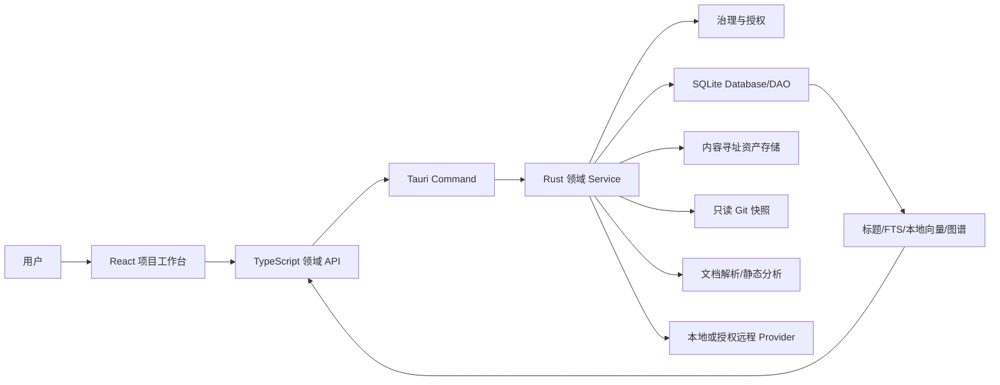
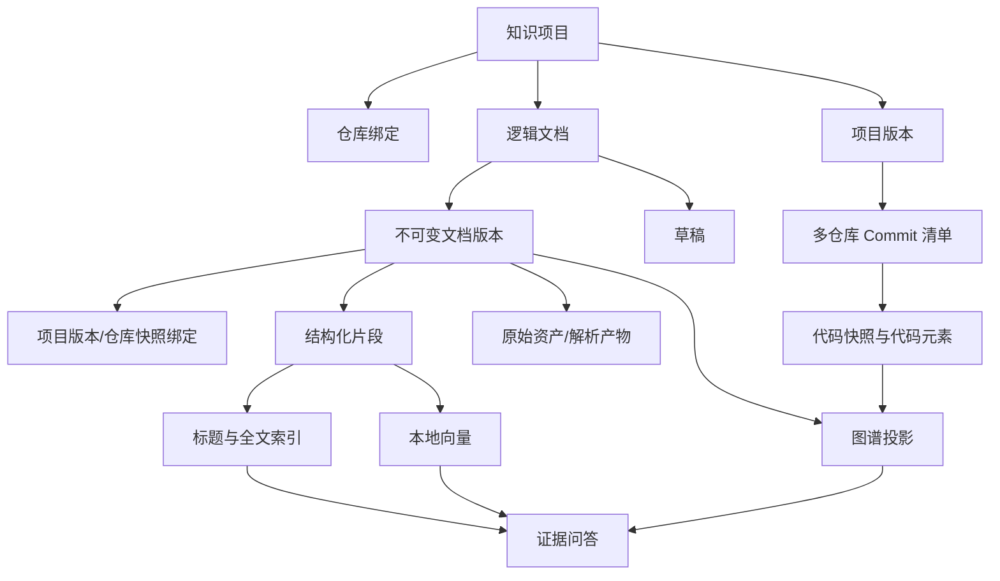

# 团队知识库重构详细需求实施方案

- 日期：2026-08-04
- 状态：Proposed（待评审确认）
- 适用项目：Tauri SSH 团队知识库
- 技术基线：Tauri 2、React 19、TypeScript、Rust、rusqlite、SQLite FTS5
- 当前源码迁移基线：`SCHEMA_VERSION = 39`
- 文档用途：作为产品、架构、开发、测试、安全和验收的统一实施入口

## 1. 文档说明

### 1.1 编制目的

本方案将原有 18 份专题方案和 1 份确认清单整理为一份端到端实施文档，统一说明：

- 要解决的产品问题与业务边界；
- 目标架构、领域职责和端到端数据流；
- 项目、多仓库、版本、文档、搜索、分析、图谱、向量和问答的实施规则；
- React、IPC、Rust Service、SQLite、文件系统和 AI Provider 的边界；
- 分阶段实施顺序、兼容迁移、功能开关和回滚策略；
- 测试、浏览器、数据库、安全、性能与真实端到端验收标准；
- 尚需用户确认的产品和技术选项。

专题文档继续作为详细决策依据，本文件作为统一评审和实施入口。未明确确认的决策保持 Proposed，不代表已经授权编码、迁移、远程发送或正式发布。

### 1.2 证据边界

本方案基于当前仓库的 OpenSpec、Rust/React 分域代码、Command 注册、前端路由、SQLite 迁移和已有测试清单整理。当前可以确认的是代码结构与规划状态，不能直接推导以下结论：

- 真实用户数据库已完成 v39 或后续版本升级；
- 所有 Office、图片和 HTML 文件都能正确解析；
- 本地向量模型已能在所有目标设备运行；
- 真实远程 AI/Embedding/视觉 Provider 已通过集成验收；
- 新知识工作台已完成全部浏览器和真实 Tauri IPC 验收；
- 构建或聚焦测试通过等于完整 RAG 闭环完成。

## 2. 背景与现状

### 2.1 现有能力

当前知识库已经具备以下可复用基础：

- 知识项目、发布版本、知识来源、逻辑文档和文档版本；
- Git 工作区来源、代码快照、代码文件、代码元素和关系；
- 文档片段、SQLite FTS5、Embedding Profile、向量和混合检索；
- 问答、引用、关系、任务和检索评测基础；
- 新分域目录下的 Catalog、Documents、Ingestion 等模型、Command、Service、Database 和 TypeScript API；
- 项目列表、项目四步设置、项目概览和新增文档页面；
- schema v39 中的仓库绑定、版本清单、资产、草稿、上传、标题索引、分析和图谱结构。

### 2.2 当前主要问题

1. 历史知识实现长期集中在大型 Rust/React 文件中，职责、状态和契约互相影响。
2. 旧页面配置项多、层级复杂，普通用户需要理解内部 ID、Git、向量和解析器术语。
3. 现有项目版本无法完整表达微服务多仓库在某次发布中的实际 Commit 组合。
4. 人工文档、上传文档、Git 文档和 AI 生成内容尚未完全统一到相同版本与审核模型。
5. Office、图片、HTML 原型和 PDF 需要统一、安全、可诊断的解析流水线。
6. 搜索、向量、图谱和问答存在功能基础，但版本硬过滤、引用校验和降级边界仍需收口。
7. 前后端曾出现默认字段漂移，说明 IPC DTO、serde 默认和 TypeScript 类型需要独立契约测试。
8. 静态检查、单元测试、浏览器、真实 Tauri IPC、数据库升级和真实 RAG 验收曾被混为同一完成状态。

### 2.3 重构策略

采用“保留数据和兼容 Facade、按领域渐进迁移、每阶段交付完整闭环”的方式：

- 不清库，不重排历史迁移，不一次性重写所有调用方；
- 旧 Command 和旧 Service 逐步变为兼容委托，禁止复制两套业务逻辑；
- 新 UI 根据用户任务重新设计，不从旧大页面机械拆组件；
- 标题与全文搜索始终作为无模型基础能力；
- 向量、图谱和 AI 通过功能开关逐阶段开放；
- 原始资产和不可变版本不因派生索引失败而删除。

## 3. 建设目标、范围与非目标

### 3.1 总体目标

建设一套以“项目 → 多仓库 → 项目版本 → 文档版本 → 可追溯证据”为主线的本地优先项目知识平台，使普通用户能够以简单、线性的方式完成知识接入、维护、检索、分析和问答。

### 3.2 功能范围

1. 创建、修改、查询、停用和软删除知识项目。
2. 一个项目关联多个已登记 Git 工作区，适配微服务多仓库场景。
3. 读取 Markdown、文本、HTML 原型、现代 Office、PDF 文本层和图片资产。
4. 手工新增、编辑、查询、软删除、恢复和上传自定义文档。
5. 提供标题搜索、全文搜索及项目/版本/仓库等筛选。
6. 按 Tag、分支或 Commit 建立多仓库不可变项目版本清单。
7. 对人工和上传文档提供草稿、提交、比较、恢复和版本绑定。
8. 对 Git 快照执行只读静态/AI 分析，人工确认后入库。
9. 从文档、代码元素和已确认关系生成版本化知识图谱。
10. 支持本地与远程 Embedding，向量始终本地存储。
11. 通过混合检索和引用校验提供基于证据的 AI 问答。
12. 统一持久化长任务、审计、质量评测、功能开关和回滚门禁。

### 3.3 用户角色

| 角色 | 主要权限 | 主要任务 |
|---|---|---|
| 项目维护者 | 项目、仓库、版本、来源配置 | 建立和维护项目知识边界 |
| 内容编辑者 | 草稿、提交、上传、恢复 | 维护可追溯知识内容 |
| 普通使用者 | 搜索、查看图谱、问答 | 获取有引用的项目知识 |
| 系统管理者 | Provider、向量、安全、配额、评测 | 管理能力、风险和发布门禁 |

首期不建设中心化账号系统或多人实时协作服务；权限以本地桌面用户、项目范围、来源授权和已有 Safe Credentials 为基础。

### 3.4 非目标

- 不建设中心化知识 SaaS、远程向量数据库或在线 Office 编辑器。
- 不执行被分析仓库的代码、构建、测试、Hook、安装脚本或二进制。
- 不让 AI 自动发布正式知识或自动确认图谱关系。
- 不承诺首期完整支持旧版 DOC/XLS/PPT、宏、复杂公式或所有嵌入对象。
- 不把真实外部 AI 服务连接作为本地功能完成的唯一门禁。
- 不通过删除旧表、清空索引或降级 `user_version` 完成回滚。
- 不继续扩展旧知识大页面的 Tabs、字段排列和配置步骤。

### 3.5 产品成功标准

- 普通用户无需理解内部 ID、Commit SHA、Profile、维度等术语即可完成项目初始化。
- 没有向量模型或 AI Provider 时，标题与全文搜索仍完整可用。
- 历史版本搜索、图谱和问答不会混入后续版本事实。
- AI 分析文档和回答中的项目事实都有可打开引用。
- 证据不足、冲突或范围歧义时明确停止并提示下一步。
- 远程能力默认关闭，凭据和敏感内容不会进入普通数据库、日志或前端状态。
- 数据迁移失败时能够保留原始资产、历史版本和旧活动索引。

## 4. 总体设计原则

### 4.1 项目、版本和证据优先

所有文档、代码、图谱、向量、搜索和问答都必须归属明确项目，并绑定项目版本或显式跨版本范围。引用至少能够回到文档版本或仓库 Commit。

### 4.2 本地优先

项目目录、原始资产、解析结果、全文索引、向量、图谱、任务和审计默认保存在本地。远程 Provider 只在明确授权后处理最小必要内容。

### 4.3 基础能力与 AI 解耦

标题搜索、全文搜索、文档查看和静态分析不依赖 AI。向量、图谱增强和问答不可用时，系统返回明确降级状态，不自动改走未授权远程路径。

### 4.4 AI 结果必须审核

AI 代码分析只产生草稿；无引用主张阻止确认。用户编辑并确认后，系统才创建正式不可变文档版本，并保留 AI 原稿和编辑差异。

### 4.5 派生数据可重建

标题索引、FTS、向量和图谱是派生数据。失败构建隔离，校验完成后原子激活，不能成为原始项目事实的唯一存储。

### 4.6 线性体验与渐进展示

主流程只展示当前步骤的必要字段；安全默认自动填充；低频技术项进入高级设置；任何异步动作立即显示状态、结果和下一步。

### 4.7 分层验收

静态检查、单元测试、数据库迁移、Tauri IPC、浏览器、本机端到端、安全和性能分别记录，缺失的层级不得显示为“已验收”。

## 5. 总体架构

### 5.1 架构分层



### 5.2 强制依赖方向

```text
React 页面/组件
  → src/lib/api/knowledge-domain/*
  → src-tauri/src/commands/knowledge_domain/*
  → src-tauri/src/services/knowledge_domain/*
  → src-tauri/src/database/knowledge_domain/*
```

- React 不直接访问 SQLite、Node.js、本地文件或任意外部 URL。
- 页面禁止裸写 `invoke()`，所有 IPC 统一由业务 API 模块封装。
- Command 只负责参数校验、状态注入、Service 调用和错误转换。
- Service 承担业务规则、授权、任务编排和跨 DAO 协作。
- Database 负责 SQL、事务、迁移和稳定行映射。
- 网络、文件、解析等异步等待期间不得持有 SQLite 锁。

### 5.3 目标领域模块

| 领域 | 后端职责 | 前端职责 |
|---|---|---|
| Catalog | 项目、仓库绑定、版本清单 | 项目列表、设置、概览 |
| Documents | 草稿、提交、详情、历史、删除恢复 | 文档目录、编辑、历史比较 |
| Ingestion | 资产复制、格式识别、解析任务 | 文件选择、确认、进度 |
| Search | 标题/FTS/向量/关系融合 | 搜索、筛选、引用打开 |
| Analysis | Git 快照、静态证据、AI 草稿 | 范围、进度、审核、确认 |
| Graph | 构建、投影、子图、关系确认 | 图谱、列表、证据详情 |
| Embedding | Profile、构建、激活、回滚 | 本地推荐/远程自定义配置 |
| QA | 范围解析、上下文、回答校验 | 提问、回答、引用、冲突 |
| Jobs | 持久化状态机、取消、重试、恢复 | 任务中心、逐项结果 |
| Governance | 权限、敏感、功能开关、评测 | 设置、安全摘要、门禁 |

### 5.4 目标前端信息架构

```text
团队知识库
  ├─ 项目列表
  │   └─ 项目工作台
  │       ├─ 概览
  │       ├─ 代码仓库
  │       ├─ 项目版本
  │       ├─ 文档
  │       ├─ 搜索
  │       ├─ 代码分析
  │       ├─ 知识图谱
  │       └─ AI 问答
  ├─ 处理任务
  └─ 知识库设置
```

推荐路由：

| 路由 | 职责 |
|---|---|
| `/knowledge/projects` | 项目目录和首次使用入口 |
| `/knowledge/projects/:id/overview` | 状态、风险和下一步 |
| `/knowledge/projects/:id/repositories` | 多仓库绑定与同步 |
| `/knowledge/projects/:id/versions` | 版本清单与完整度 |
| `/knowledge/projects/:id/documents` | 文档列表、创建、上传和历史 |
| `/knowledge/projects/:id/search` | 标题/全文及高级搜索 |
| `/knowledge/projects/:id/analysis` | 分析任务和草稿审核 |
| `/knowledge/projects/:id/graph` | 版本化知识图谱 |
| `/knowledge/projects/:id/qa` | 基于证据问答 |
| `/knowledge/jobs` | 统一任务中心 |
| `/knowledge/settings` | Provider、向量、安全和配额 |

## 6. 核心数据模型

### 6.1 业务实体关系



### 6.2 表族与所有权

| 表族 | 主要实体 | 数据性质 |
|---|---|---|
| 目录 | projects、releases、repository_bindings、release_manifests | 核心事实 |
| 文档 | documents、versions、drafts、version_bindings、uploads | 核心事实 |
| 资产/解析 | assets、parse_artifacts、chunks | 原始资产引用与解析事实 |
| 代码分析 | code_snapshots/files/elements/relations、analysis_runs/drafts | 快照事实与审核草稿 |
| 搜索 | title_index、FTS | 可重建派生数据 |
| 向量 | embedding_profiles、chunk_embeddings | 可重建派生数据与活动配置 |
| 图谱 | graph_builds/nodes/edges | 可重建派生投影 |
| 运维 | jobs、backfill_runs、coverage、evaluation_runs、feature_flags | 任务、评测与门禁 |

### 6.3 数据不变量

1. 项目具有稳定 ID；规范化项目名称在有效项目中唯一。
2. 同一项目和 Git 工作区只有一个有效仓库绑定。
3. 项目版本清单中的完整 Commit SHA 创建后不可变。
4. 逻辑文档具有稳定 ID，正式文档版本不可修改。
5. 历史恢复通过创建新草稿和新版本实现。
6. 未绑定文档不得自动归入最新项目版本。
7. 草稿、软删除、无权限和解析失败正文不得进入活动索引。
8. 资产按内容哈希去重，引用计数必须与实际绑定一致。
9. 同维度不同模型、不同分块或不同规范化配置不得复用向量。
10. 图谱节点和关系必须包含项目/版本范围及证据引用。

## 7. 核心业务域实施方案

### 7.1 项目与多仓库目录

#### 业务规则

- 用户可创建、查询、修改、停用和软删除项目。
- 项目允许绑定多个已登记 Git 工作区。
- 批量关联全成全败，避免微服务项目出现部分保存。
- 仓库绑定保存别名、角色、默认分支、版本策略、启用和最近状态。
- 解除关联只停止后续同步，保留历史版本、文档、引用和审计。
- 仓库检查只读，禁止 checkout、stash、reset、clean、pull、push、Hook 和脚本。

#### 实施链路

1. 前端项目向导收集名称、描述和仓库选择。
2. Catalog API 创建或更新项目。
3. Service 校验名称唯一、工作区有效和重复绑定。
4. Database 在单事务中替换仓库绑定。
5. Service 只读检查仓库状态、HEAD、分支和 Tag。
6. 前端进入项目版本步骤并显示可读摘要。

#### 当前状态与缺口

- 项目列表、四步设置、项目概览和分域 Catalog 链路已有基础。
- 仍需真实多仓库、移除工作区、批量冲突、脏仓库和解除历史的 IPC/浏览器闭环。

#### 验收重点

- 一次关联 4 个微服务仓库。
- 任一仓库冲突时无部分数据残留。
- 脏仓库显示“存在本地改动”，但不改变工作树。
- 解除后历史引用可打开，新同步停止。

### 7.2 项目版本治理

#### 版本模型

项目版本是一份多仓库不可变清单。每个仓库记录请求引用类型、请求引用名称、解析后的完整 Commit SHA、采集类型、脏状态、采集时间和包含/排除状态。

#### 引用语义

- Tag/Commit：创建后视为固定证据。
- Branch：仅为创建规则；每次采集固化当时 Commit，刷新产生新记录。
- Worktree：只用于明确标识的临时分析，默认不可绑定正式项目版本。

#### 多仓库映射

优先推荐所有仓库共同存在的 Tag。若某仓库缺失，用户必须逐仓库覆盖或明确排除，禁止静默使用 HEAD。只有全部启用仓库已映射或排除，版本清单才算完成。

#### 完整度

项目版本分别统计仓库采集、文档同步、解析、标题/全文、分析、图谱和向量状态。清单完成不等于全部知识就绪；只有满足阶段门禁才显示“可完整使用”。

#### 当前缺口

清单创建基础已存在，仍需统一文档绑定、完整度、新版本页面和跨版本检索/问答隔离验收。

### 7.3 文档接入与格式解析

#### 接入流水线

```text
用户选择文件或 Git 发现文档
  → Rust 路径/授权校验
  → 文件签名、MIME、扩展名、大小和敏感检测
  → 原子复制到内容寻址资产区
  → 解析器注册表选择适配器
  → 输出文本、结构块、附件、质量和警告
  → 建立文档版本及项目版本绑定
  → 创建标题/FTS/向量/图谱任务
```

#### 首期格式范围

| 格式 | 首期提取内容 | 限制 |
|---|---|---|
| Markdown/MDX/TXT/LOG/JSON/YAML/SQL | 标题、正文、代码块、行号 | 编码失败可诊断 |
| HTML/HTM | 清洗后可见文本、控件、相对资源 | 不执行脚本、不加载远程资源 |
| DOCX | 标题、段落、列表、表格、图片引用 | 不执行宏，不保证复杂嵌入对象 |
| XLSX | 工作表、单元格、表格、命名区域、公式文本/缓存值 | 不计算公式 |
| PPTX | 幻灯片文本、备注、表格、图片引用、页码 | 动画和复杂对象可部分解析 |
| PDF | 文本层、页码、扫描页检测 | 无 OCR 不虚构正文 |
| PNG/JPEG/WebP/GIF/SVG | 元数据、受控预览、可选 OCR | SVG 清洗，远程视觉单独授权 |
| DOC/XLS/PPT | 可选隔离转换器 | 未配置时明确不支持 |

#### 推荐默认限制

| 项目 | 默认值 |
|---|---:|
| 单文件原始大小 | 20 MiB |
| 单次文件数量 | 50 |
| 单批原始总量 | 100 MiB |
| OOXML/容器条目数 | 2,000 |
| 容器展开总量 | 200 MiB |
| 嵌套压缩 | 深度 1，默认拒绝内部容器 |
| 单文件解析时长 | 30 秒 |
| 单项目受管资产 | 2 GiB，80% 提醒 |

#### 解析结果契约

统一返回 parser ID/版本、原始/规范化哈希、语言、结构块、稳定位置、附件引用、质量等级、警告和失败原因。部分解析不得标记为完全成功；只有成功且可见的提交版本进入活动索引。

### 7.4 受管文档生命周期与自定义版本

#### 生命周期

```text
草稿 → 提交正式版本 → 解析/索引 → 可用
                           ├→ 部分成功
                           └→ 失败（保留资产和版本）
可用 → 软删除 → 恢复并幂等重建索引
```

#### CRUD 规则

- 人工新增默认创建 Markdown 草稿。
- 上传文件先形成资产和上传任务，解析后创建正式文档版本。
- 草稿使用 revision 乐观并发，冲突时禁止静默覆盖。
- 正式版本不可修改，后续编辑从当前或历史版本创建新草稿。
- 普通删除统一软删除；永久删除为独立高风险操作。
- 已删除内容不进入新检索，但历史引用快照和审计保留。

#### 文档与项目版本绑定

每个提交版本必须绑定一个项目版本，或显式标记为跨版本共享。未绑定状态可保存但不得默认出现在某个历史版本结果中。跨版本共享默认关闭，并在搜索和问答引用中明确标识。

#### 比较与恢复

- Markdown/文本提供逐行差异。
- Office 提供解析结构、工作表/页码、资产哈希和解析器版本差异。
- 恢复历史创建新草稿，提交后产生新的父子版本，不修改历史内容。

#### 当前状态与缺口

资产、草稿、提交、上传、恢复和版本绑定已有代码基础；仍需文档目录、详情编辑、历史比较、删除恢复页面和真实上传闭环。

### 7.5 标题与全文搜索

#### 搜索通道

1. 标题精确匹配。
2. 标题前缀匹配。
3. 标题包含匹配。
4. SQLite FTS5 全文匹配。
5. 可选向量召回。
6. 可选已确认图谱关系扩展。

标题与全文为始终可用的基础通道；可选通道失败时返回降级摘要，不影响基础搜索。

#### 硬过滤

在排序前统一应用项目、项目版本、仓库、Git 快照、文档类型、来源、状态、标签和权限过滤。草稿、软删除、未授权和解析失败正文不得进入正式结果。

#### 排序、去重和解释

首期推荐规则优先级：标题精确 > 标题前缀 > 标题包含 > 正文；可选通道通过 RRF 等稳定融合方法合并。同一逻辑文档的多通道命中合并为一项，引用落到具体版本和结构位置。

用户默认看到“标题命中”“正文命中”“关联内容”等业务解释，不展示内部浮点分数；技术诊断进入详情。

#### 分页

采用稳定排序键和游标。游标绑定查询条件和结果快照；索引变化时继续原快照或提示结果已更新。默认 50 条，上限 100 条。

#### 性能目标

在代表性本机语料中，标题搜索 P95 不高于 50ms，全文搜索 P95 不高于 100ms。必须记录数据规模、查询条件和执行计划。

### 7.6 AI 代码分析与人工审核

#### 分析流程

```text
选择项目版本
  → 冻结多仓库 Commit 清单
  → 只读遍历 Git 对象
  → 提取文件、代码元素、API/IPC、SQL、配置和测试证据
  → 敏感检测和上下文预览
  → AI 生成有引用草稿
  → 引用与主张校验
  → 用户查看、编辑和比较
  → 确认后提交正式知识文档
```

#### 静态证据

无论是否配置 AI，都先确定性生成仓库、模块、接口、数据库、配置和测试清单。分析质量区分 AST、结构化降级、纯文本和已跳过。界面使用“代码元素”，技术术语只在详情解释。

#### Git 安全

- 使用 Git 对象读取 Commit 内容，不 checkout。
- 路径遍历使用 NUL 分隔和原始字节安全解码，覆盖中文及转义路径。
- 排除规则在内容读取前应用。
- 不执行代码、脚本、构建、测试、Hook 或二进制。
- 脏工作区必须显式标记，不能当作发布版本。

#### AI 草稿

草稿保存 Provider、模型、模板、分析器版本、证据哈希、项目版本和仓库 Commit。每个内部事实必须关联引用；无效引用、无引用主张或范围外内容阻止入库。

#### 交互

按钮必须显示读取快照、分析中、等待审核、已完成或失败；分析中禁止重复点击；失败提供阶段、原因和重试；AI 原稿和人工编辑差异永久保留。

### 7.7 版本化知识图谱

#### 定位

图谱是从来源事实构建的可重建投影。文档关系、代码关系和人工确认关系继续保留来源所有权，统一图谱用于跨来源查询、检索增强和可视化。

#### 节点与关系

首期节点包括项目、仓库、项目版本、文档、章节、需求、代码元素、模块、API/IPC、数据库对象、配置和测试。关系包括包含、描述、实现、调用、依赖、读写、验证、失败于、引用和演进到。

#### 可信度

- 解析器/静态分析确定性关系：保存算法和证据。
- 人工确认关系：进入默认图谱和问答增强。
- AI 建议关系：默认未确认，不参与事实回答。

#### 构建与查询

按项目版本、来源哈希和投影版本增量构建；新投影校验后原子激活。默认查询当前实体一层已确认关系，支持有界扩展。默认 1,000 节点，硬上限 5,000。

#### 展示

首期采用 Canvas 有界子图，并提供可访问关系列表。点击节点或边能够重新打开精确证据。同名实体不能跨版本自动合并，跨版本只能通过显式“演进到”等关系连接。

### 7.8 本地/远程向量化与本地存储

#### 架构

Embedding Provider 只负责计算向量；文本片段、向量、Profile、构建、激活和评测全部保存在本地 SQLite。首期不引入远程向量数据库。

#### 模式

- 本地推荐：默认优先，自动检测运行时、模型、维度和资源。
- 远程自定义：默认关闭，选择已登记且具备 embedding 能力的 Provider。

本地失败不得自动切换远程。远程构建前展示项目/版本、文档数、字符数和敏感阻断摘要。

#### Profile 指纹

至少包含 Provider 类型、模型、修订、维度、文本前缀、归一化、距离算法、解析器/规范化版本、分块配置和版本绑定规则。

#### 蓝绿生命周期

```text
估算 → 构建候选 → 校验维度/覆盖/质量
     → 原子激活 → 保留上一活动版本 → 可回滚 → 过期清理
```

失败或取消不能破坏当前活动向量。只有内容哈希和完整指纹都相同才允许复用。

#### 检索技术

首期继续采用项目/版本硬过滤后的 SQLite + Rust 余弦召回。只有代表性规模 P95 证明不足时才评估 ANN/HNSW；ANN 仍必须是可重建派生索引。

### 7.9 基于证据的 AI 问答

#### 问答流程

```text
问题
  → 解析项目/版本/仓库范围
  → 标题 + 全文 + 可选向量 + 已确认图谱召回
  → 权限/敏感/版本/状态过滤
  → 去重、融合和上下文预算
  → Chat Provider 生成
  → 主张-引用校验
  → 返回答案、引用、冲突和缺口
```

#### 范围规则

范围歧义时返回候选项目或版本并停止，不让模型猜测。跨版本比较必须由用户显式开启，后续版本内容放在独立“后续演进”区域。

#### 回答结构

- 当前范围；
- 结论摘要；
- 需求/设计与实现证据；
- 测试或运行证据；
- 风险、冲突和缺口；
- 可打开引用。

#### 引用与拒答

内部事实必须有项目、版本、文档版本或仓库 Commit、位置和内容哈希。证据冲突时并列展示；证据不足时回答“现有知识库无法确认”并说明需要补充的材料。

#### Provider

只展示具备 chat 能力的 Provider，Embedding-only 不得进入问答选项。远程问答与远程 Embedding 分开授权。普通用户使用推荐默认，Provider、TopK 和上下文预算进入高级设置。

### 7.10 持久化任务与可观测治理

#### 任务范围

来源同步、文件解析、代码分析、标题回填、向量构建、图谱构建和大型迁移回填统一进入持久化任务系统。

#### 状态机

```text
queued → running → completed
               ├→ failed → queued（重试）
               ├→ cancelling → cancelled
               └→ interrupted → queued（显式恢复）
```

每个执行器定义幂等键、检查点、心跳、取消边界、可重试错误、临时清理、结果完整性和审计关联 ID。任务 payload 只保存可重放引用和配置快照，不保存 Token 或大段敏感正文。

#### 用户反馈

长操作提交后立即创建可见任务；前端轮询或事件更新状态；终态后刷新业务结果。无变更显示“没有发现需要更新的内容”，不使用误导性的 `0/?`。

## 8. IPC、API 与错误契约

### 8.1 API 分组

| API 组 | 主要方法 |
|---|---|
| Catalog | 项目 CRUD、仓库绑定、仓库检查、版本清单 |
| Documents | 草稿保存、提交、详情、历史、比较、删除/恢复 |
| Ingestion | 上传准备、单/批上传、解析任务 |
| Search | 搜索、命中解释、引用详情 |
| Analysis | 启动分析、草稿查询/保存、确认入库 |
| Graph | 构建、子图、关系确认、证据详情 |
| Embedding | Profile、估算、构建、激活、回滚 |
| QA | 上下文预览、提问、引用打开 |
| Jobs | 列表、详情、取消、重试 |
| Governance | 功能开关、授权、配额、评测门禁 |

### 8.2 DTO 规则

每个请求和响应都必须定义字段名、Rust/TypeScript 类型、必填、默认、可空、枚举、时间格式、分页和错误。Rust 使用显式 serde 命名/default；TypeScript 镜像字段。以下字段必须重点做往返测试：

- `versionStrategy`；
- `allowRemoteProcessing`；
- 项目版本/仓库快照范围；
- 可空 projectVersionId；
- 分页游标；
- Provider 能力和远程授权；
- 任务幂等键与状态枚举。

### 8.3 错误分类

| 错误类别 | 用户行为 |
|---|---|
| 输入校验 | 定位到字段并保留输入 |
| 未找到 | 返回项目/文档列表或重试 |
| 并发冲突 | 比较当前版本与本地草稿 |
| 未授权/敏感阻断 | 显示范围和申请/调整建议 |
| 能力不可用 | 显示缺失模型、解析器或 Provider |
| 超限 | 显示限制和拆分建议 |
| 处理中 | 跳转任务详情 |
| 解析/Provider 失败 | 显示安全摘要和可重试性 |
| 数据库/内部错误 | 显示关联 ID，不暴露堆栈或路径 |

### 8.4 兼容策略

旧 Command 保留兼容 Facade，新 Service 作为单一业务实现。兼容层可以补安全默认值，但不得为缺失关键项目/版本范围自动选择可能错误的“最新值”。新 UI 全量验收后，旧 Command 推荐继续保留两个发布版本，再独立评审移除。

## 9. 用户体验实施方案

### 9.1 六条线性主流程

| 场景 | 默认流程 | 高级内容 |
|---|---|---|
| 首次使用 | 创建项目 → 选择仓库 → 选择版本 → 确认同步 | 仓库角色、逐仓库版本、排除规则 |
| 上传文档 | 选择文件 → 自动识别 → 确认项目/版本 → 开始处理 | 可见范围、解析策略、跨版本共享 |
| 手工文档 | 新建草稿 → 编辑 → 保存 → 提交说明 → 正式版本 | 编辑者、父版本、共享范围 |
| 搜索 | 输入关键词 → 查看结果 → 打开证据 | 仓库、类型、来源、状态、检索通道 |
| 代码分析 | 选择版本 → 确认范围 → 查看进度 → 审核草稿 → 确认入库 | Provider、证据范围、模板 |
| AI 问答 | 继承项目/版本 → 提问 → 查看回答与引用 | Provider、上下文预览、跨版本比较 |

### 9.2 字段分级

| 级别 | 定义 | 示例 |
|---|---|---|
| 必填 | 无法安全推断 | 项目名称、问题文本 |
| 推荐默认 | 可根据上下文安全选择 | 当前项目/版本、默认分支、本地向量 |
| 按需确认 | 发生差异或风险时展示 | 缺 Tag、格式冲突、敏感阻断 |
| 高级设置 | 低频技术配置 | Commit SHA、维度、分块、关系深度 |

### 9.3 中文术语

| 技术术语 | 默认展示 |
|---|---|
| Repository | 代码仓库 |
| Release Manifest | 项目版本清单 |
| Embedding Profile | 向量方案 |
| Chunk | 内容片段 |
| Code Symbol | 代码元素 |
| Fingerprint | 配置标识 |
| Checkpoint | 处理进度点 |
| Evidence-only | 只根据知识库证据回答 |

内部 enum、API 和数据库值保持稳定，所有新增或修改的下拉、单选、多选、菜单和状态使用中文展示。

### 9.4 交互反馈

- 点击长任务后立即显示正在做什么并禁用重复提交。
- 成功信息包含完成内容和下一步，不只显示“成功”。
- 部分成功展示成功/失败数量和逐项重试。
- 失败保留表单、草稿和已选文件，并提供重试或返回。
- 删除、永久清理、远程发送、分析确认和 Profile 激活使用二次确认。
- 返回上一步、关闭弹窗或校验失败时保留未提交输入。

### 9.5 页面状态

每个后端数据页面分别覆盖：首次 loading、空数据、可重试 error、有数据、写操作提交中、成功、部分成功、取消和无权限。页面不得用截图或静态 mock 代替真实交互结论。

### 9.6 可访问性和桌面适配

- 所有表单项有可见 label。
- 图标按钮有 Tooltip 和可访问名称。
- Modal/Drawer 输入场景防止遮罩误关。
- 键盘可完成主流程和图谱选择。
- 在最小、常用和较大桌面窗口验证滚动、表格和长文本。
- Canvas 图谱同时提供可访问的关系列表。

## 10. 安全、权限与审计

### 10.1 保护资产

- Git 仓库代码与历史；
- 内部需求、设计、测试、配置和数据库文档；
- Git、AI、SSH、数据库等凭据；
- 本地向量、问答上下文和分析草稿；
- 用户选择的本地文件和应用数据目录资产。

### 10.2 信任边界

WebView、IPC 参数、文件路径、上传内容、Git 路径、HTML/SVG、Office 容器、远程响应和模型输出都视为不可信。前端校验只改善体验，Rust 必须再次执行类型、长度、路径、格式、范围和授权校验。

### 10.3 四阶段控制

#### 读取阶段

- 只读取已登记 Git 工作区、用户选择文件或授权目录。
- 规范化路径并防止 `..`、符号链接逃逸和设备路径。
- 校验文件签名、MIME、扩展名、数量、大小和容器展开限制。
- Git 只允许只读参数白名单。

#### 落盘阶段

- 使用内容寻址资产和同目录临时文件原子复制。
- 记录存储键，不向前端返回受控目录绝对路径。
- 对敏感内容做检测、隔离和最小化元数据保存。
- 失败清理临时文件并保持引用计数一致。

#### 远程阶段

- Embedding、视觉/OCR、代码分析和问答分别授权。
- 校验系统开关、来源授权、文档敏感级别、内容规则和 Provider 能力。
- 使用 Safe Credentials 引用，不保存或返回 Token。
- 限制 HTTPS host、端口、路径、重定向、超时和响应大小。
- 远程失败不得自动切换未授权 Provider。

#### 输出阶段

- 搜索、问答、图谱、导出和 MCP 再次应用项目、版本、权限和敏感过滤。
- 引用不得暴露凭据、连接串、内部绝对路径或完整敏感正文。
- 错误对用户可诊断，但不包含堆栈和秘密。

### 10.4 敏感检测

在持久化、远程发送、搜索、问答、MCP 和导出前检测私钥、Token、密码、连接串、凭据文件和 restricted 内容。默认只保存路径、哈希、规则和阻断结果，不保存秘密正文。

### 10.5 审计事件

审计项目/仓库配置、上传、删除/恢复、远程处理、分析确认、Profile 激活/回滚、关系确认、MCP 调用和问答引用。记录主体、动作、目标引用、结果、时间、关联 ID 和安全摘要，不记录完整正文或请求头。

### 10.6 MCP 边界

首期 MCP 默认只读，开放项目、版本、搜索、文档、图谱、引用和问答。写文档、确认关系、触发远程处理和任何 Git 写入应另设受控 Command 和审批，首期可以不开放。

## 11. SQLite 迁移与兼容方案

### 11.1 基线

当前源码 `src-tauri/src/database/schema.rs` 的 `SCHEMA_VERSION` 为 39。实施每个阶段前都必须重新读取最新版本，使用下一个连续迁移号，不假设基线长期固定。

### 11.2 迁移类型

1. 小型核心 DDL：项目、仓库清单、资产、草稿、绑定、分析运行等。
2. 数据回填：安全、短小且必须与 DDL 同事务完成的数据转换。
3. 大型派生构建：标题、FTS、Office 重解析、向量和图谱，全部后台任务化。

### 11.3 迁移规则

- 只追加前向迁移，不复用、删除或重排历史版本。
- 多条关联 DDL/DML 使用事务，失败不得提前推进 `user_version`。
- 应用拒绝打开高于自身支持版本的数据库。
- 启动过程不执行 Office 重解析、全量向量或全量构图。
- 大型回填使用幂等任务、检查点和可见状态。
- 迁移前对数据库大小和备份空间做预检。

### 11.4 升级验证

- 空库初始化到最新版本。
- v36、v37、v38、v39 以及实施时最新上一版本逐级升级。
- 含项目、版本、文档、向量、关系和任务数据的代表性副本升级。
- 中途失败、再次启动、唯一约束冲突和未来版本拒绝。
- 迁移前后表数量、当前版本指针、资产引用和孤立记录核对。

### 11.5 回滚

不降级 `user_version`。回滚通过功能开关恢复旧 Facade、旧页面回滚壳或旧活动索引。标题、FTS、向量和图谱候选构建失败时继续使用旧活动版本。原始资产、逻辑文档和不可变版本永不随派生回滚删除。

## 12. 分阶段实施计划

### 12.1 总体顺序


### 12.2 P0：需求、契约与基线确认

#### 目标

固定用户决策、当前 schema、现有接口、数据夹具、功能开关和验收口径。

#### 主要任务

- 确认本文档和 16 个开放决策。
- 重新读取当前工作树、schema、Command、API、路由和测试。
- 建立旧接口到新领域 API 的契约映射。
- 建立多仓库、文档、向量、关系和任务的无敏感测试夹具。
- 定义目录、文档、解析、搜索、分析、图谱、向量和问答功能开关。

#### 退出门禁

- 核心决策已确认；
- DTO/错误/默认值矩阵完整；
- 当前数据库版本和迁移冲突已核对；
- 不把旧 UI 交互作为新 UI 基线。

### 12.3 P1：项目、多仓库、版本与文档闭环

#### 目标

完成“创建项目 → 关联仓库 → 创建初始版本 → 新建/上传文档 → 查看处理状态”的真实闭环。

#### 主要任务

- 收口项目 CRUD、仓库事务绑定、只读检查和解除历史。
- 完成项目版本清单页面和初始完整度。
- 完成文档列表、详情、草稿编辑、提交、历史比较、软删除和恢复。
- 完成单/批文件上传、资产复制、任务进度和逐项结果。
- 补齐 Catalog/Documents/Ingestion 的 Tauri/开发接口对等测试。

#### 退出门禁

- 真实浏览器完成项目和文档主流程；
- 真实 Tauri IPC 保存相同数据；
- 多仓库不会被修改；
- v39/实施时最新库升级副本验证通过；
- 并发冲突、上传失败和恢复索引行为正确。

### 12.4 P2：异构解析、标题与全文搜索

#### 目标

完成受支持格式的安全解析和无模型搜索闭环。

#### 主要任务

- 固化解析器注册表和统一结果契约。
- 补齐图片元数据、本地 OCR 适配器和旧 Office 能力错误。
- 增加损坏、加密、压缩炸弹、脚本、符号链接和 Unicode 夹具。
- 实现标题规范化索引、回填和精确/前缀/包含匹配。
- 调整 FTS 只索引当前可见提交版本。
- 实现硬过滤、稳定游标、解释、高亮和引用打开。
- 建立搜索页面和高级筛选。

#### 退出门禁

- 每类格式至少有正常、部分成功、损坏和超限用例；
- 无向量/AI 时搜索可用；
- 历史版本无串用；
- 标题/全文 P95 达到目标；
- HTML/SVG/Office 不执行活动内容。

### 12.5 P3：版本完整度与 AI 代码分析审核

#### 目标

完成多仓库版本证据冻结和“静态证据 → AI 草稿 → 人工确认入库”。

#### 主要任务

- 收口 GitSnapshotReader，支持 NUL 路径和对象读取。
- 实现版本各阶段完整度和不完整提示。
- 冻结分析运行配置、范围、Commit 和证据哈希。
- 生成确定性仓库/模块/API/数据库/测试报告。
- 实现 Provider 能力筛选、远程授权和上下文预览。
- 实现 AI 草稿、引用校验、编辑差异和确认入库事务。
- 新建分析页面和任务状态反馈。

#### 退出门禁

- 4 仓库分析不修改工作树；
- 中文/转义路径、`.codex/**` 排除和敏感文件正确；
- 无效引用无法入库；
- 确认文档可以标题/全文搜索并打开 Commit 证据；
- 无 AI 时静态报告保底行为符合确认结果。

### 12.6 P4：版本化知识图谱

#### 目标

完成来源关系到统一投影的增量构建、查询、确认和证据展示。

#### 主要任务

- 定义实体键和关系类型注册表。
- 构建版本化节点/边投影和来源反向引用。
- 实现增量构建、候选校验、激活和回滚。
- 实现有界子图查询、关系确认和证据详情。
- 构建 Canvas 图谱和可访问关系列表。
- 图谱增强接入搜索，但默认只使用已确认边。

#### 退出门禁

- 跨版本同名实体不错误合并；
- 构建失败不影响旧图谱；
- AI 未确认边不参与事实回答；
- 节点和边均能打开证据；
- 1,000/5,000 节点限制和键盘操作通过验收。

### 12.7 P5：向量与基于证据的 AI 问答

#### 目标

完成本地向量、远程协议、混合检索、引用回答、拒答和冲突闭环。

#### 主要任务

- 扩展完整 Profile 指纹和新文档版本绑定。
- 完成本地模型检测、导入、构建、激活和回滚。
- 通过本机回环 Provider 验证远程授权、超时、限流和部分响应。
- 整合标题、全文、向量和已确认图谱召回。
- 构建稳定引用上下文和主张-引用校验。
- 实现 Provider 能力筛选、拒答、冲突和后续演进。
- 建立向量配置页和问答页。

#### 退出门禁

- 本地向量可核对且断网仍可搜索；
- 远程只接收授权的最小内容；
- 失败候选不激活且可回滚；
- 版本串用率为 0；
- 可验证内部事实引用率 100%；
- 无证据问题明确拒答。

### 12.8 P6：评测、发布门禁和兼容收口

#### 目标

完成全链路评测、迁移演练、阶段开放和旧入口收口计划。

#### 主要任务

- 固定评测集并记录数据集、项目/版本、索引、模型和环境。
- 汇总解析覆盖、检索质量、问答引用、任务可靠性和资源指标。
- 执行数据库副本升级和失败恢复演练。
- 执行真实浏览器、Tauri IPC、本机端到端、安全和性能验收。
- 分阶段打开新入口，观察错误率和版本串用率。
- 新路径稳定后制定旧 Command、旧 UI 和冗余索引移除计划。

#### 退出门禁

- 无 P0/P1 正确性或安全缺陷；
- 所有阶段门禁有可复核证据；
- 旧入口回滚路径可用；
- 未验证的真实外部服务和目标平台明确列出；
- 用户确认兼容保留周期和后续清理范围。

## 13. 逐阶段最小交付单元

每个业务域按照以下顺序形成最小可提交单元：

1. Rust/TypeScript 契约与往返测试。
2. SQLite 迁移、DAO 和含数据副本验证。
3. Service 业务规则、授权和错误。
4. Command 注册、API 封装和真实 IPC。
5. React 页面、状态、空/错/成功/取消反馈。
6. Codex 内置浏览器或 Control Chrome 真实交互验收。
7. 安全、性能、格式化和 `git diff --check`。

不建议先完成所有后端再统一开发前端，也不建议先搭全量 UI 再补真实数据。每个领域应尽快闭合真实用户动作和数据结果，减少新旧路径长期并存。

## 14. 文件影响范围

| 位置 | 目标变化 |
|---|---|
| `src-tauri/src/models/knowledge_domain/` | 分域 DTO、明确 serde/default/枚举 |
| `src-tauri/src/commands/knowledge_domain/` | 薄 Command、参数校验、结构化错误 |
| `src-tauri/src/services/knowledge_domain/` | 各领域业务规则和任务编排 |
| `src-tauri/src/database/knowledge_domain/` | 分表族 DAO、事务和稳定映射 |
| `src-tauri/src/services/knowledge_parser.rs` | 解析器注册表和质量协议 |
| `src-tauri/src/services/knowledge_embedding.rs` | 新文档版本、完整指纹、蓝绿生命周期 |
| `src-tauri/src/services/knowledge_retrieval.rs` | 标题通道、硬过滤、图谱和稳定引用 |
| `src-tauri/src/services/knowledge_policy.rs` | 文件、远程、敏感和输出治理 |
| `src-tauri/src/database/schema.rs` | 连续迁移、回填元数据和升级测试 |
| `src-tauri/src/lib.rs` | 新 Command 注册和旧接口兼容 |
| `src/pages/knowledge/` | 项目工作台和分域页面 |
| `src/lib/api/knowledge-domain/` | 类型安全 API 和契约测试 |
| `src/types/knowledge-domain/` | Rust DTO 镜像 |
| `src/store/knowledge.ts` | 仅保存项目/版本选择和 UI 筛选 |
| `src/Router.tsx`、`Sidebar.tsx` | 新子路由和中文导航 |
| `src-tauri/tests/`、`src/pages/knowledge/**/*.test.tsx` | 迁移、IPC、页面和真实 fixture 回归 |

## 15. 测试与验收方案

### 15.1 验证分层

| 层级 | 验证内容 | 不可替代 |
|---|---|---|
| 静态 | 格式、类型、lint、构建、diff | 运行时行为 |
| 单元/契约 | DTO、解析器、Service、融合、引用校验 | 桌面链路 |
| 数据库 | 初始化、升级、约束、事务、真实数据副本 | 页面/AI |
| Tauri IPC | Command 注册、参数、错误、真实状态 | 浏览器 UX |
| 浏览器 | 主流程、空/错/成功、控制台、布局 | 原生权限/模型 |
| 本机端到端 | Git/文件→任务→索引→引用→回答 | 生产/全平台 |
| 回环 Provider | 远程协议、授权、超时、限流、响应上限 | 真实第三方质量 |
| 安全/性能 | 越界、秘密、恶意文件、P50/P95、资源 | 业务正确性 |

### 15.2 必测数据集

- 4 个微服务仓库：共享 Tag、不同 Tag、分支移动、脏工作树和中文路径。
- Markdown、HTML 原型、DOCX、XLSX、PPTX、PDF、图片及损坏/恶意样本。
- 同名标题、版本号、类名、接口路由、数据库字段和自然语言同义问题。
- 文档冲突、失败测试、后续版本变化、无证据问题和敏感内容。

### 15.3 质量指标

| 指标 | 首期目标 |
|---|---:|
| 标题搜索 P95 | ≤ 50ms |
| 全文搜索 P95 | ≤ 100ms |
| 版本串用率 | 0 |
| 可验证内部事实引用率 | 100% |
| 无证据问题明确拒答 | 100% |
| 重复任务产生重复正式结果 | 0 |
| 敏感内容外发或日志泄漏 | 0 |

上述指标必须绑定固定评测集、语料版本、配置、模型、环境和时间，不能比较不可复现结果。

### 15.4 页面验收任务

1. 空知识库创建多仓库项目。
2. 返回上一步后数据保留。
3. Tag 缺失时逐仓库处理。
4. 新建草稿、提交、冲突、历史恢复。
5. 上传正常、损坏、超限和部分失败文件。
6. 搜索无结果、降级、分页和打开引用。
7. 分析重复点击、失败、重试、编辑和确认入库。
8. 图谱缩放、键盘、超限和证据打开。
9. 问答有证据、无证据、冲突和范围歧义。
10. 页面控制台无未处理错误，最小窗口内容可达。

## 16. 风险、缓解与回滚

| 风险 | 影响 | 缓解/回滚 |
|---|---|---|
| 新旧接口长期并存 | 契约漂移、重复逻辑 | 单一 Service、兼容测试、按域迁移 |
| 多会话并发修改 | 覆盖他者 WIP | L1/L2/L3 避让、逐文件修改、不 stash/reset |
| Office/OCR 依赖问题 | 包体、漏洞、启动失败 | 可选适配器、锁文件审计、能力状态 |
| 恶意文档 | 内存/CPU/脚本风险 | 签名、限额、清洗、超时、隔离 |
| 多仓库版本配置复杂 | 用户错误、版本串用 | 共同 Tag 推荐、差异时才展开 |
| SQLite 大回填 | 启动慢、失败难恢复 | 后台任务、检查点、短事务 |
| AI 草稿被当事实 | 错误知识入库 | 草稿状态、引用校验、人工确认 |
| 本地模型不可用 | 向量/问答中断 | 标题/FTS 独立、确定性分析保底 |
| 远程内容泄露 | 安全事故 | 四层授权、最小上下文、Safe Credentials |
| 图谱规模膨胀 | 页面卡顿、认知负担 | 有界子图、节点上限、关系列表 |

回滚原则：

- 数据库只前向迁移，不降级 `user_version`。
- 功能域独立开关，可恢复旧 Facade 或旧入口回滚壳。
- 新标题/FTS/向量/图谱候选校验后才激活。
- 远程处理可以全局关闭，不影响本地文档和基础搜索。
- 原始资产、不可变版本和历史引用不随派生功能回滚删除。

## 17. 需求追踪矩阵

| 用户需求 | 方案章节 | 主要验收证据 |
|---|---|---|
| 1. 项目与多 Git 仓库 | 7.1、7.2、12.3 | 多仓库事务绑定、只读 Git、浏览器向导 |
| 2. Markdown/Office/图片/HTML | 7.3、12.4 | 真实格式和恶意夹具、解析质量 |
| 3. 文档 CRUD 与上传 | 7.4、12.3 | 草稿/提交/上传/删除恢复闭环 |
| 4. 标题与全文搜索 | 7.5、12.4 | 标题排序、FTS、过滤、分页、P95 |
| 5. AI 分析生成文档 | 7.6、12.5 | 只读快照、引用草稿、人工确认 |
| 6. 分支/Tag 版本 | 7.2、12.3、12.5 | 不可变 Commit 清单、跨版本隔离 |
| 7. 自定义文档版本 | 7.4 | 草稿、不可变提交、比较和恢复 |
| 8. 知识图谱 | 7.7、12.6 | 版本化投影、关系确认、证据打开 |
| 9. 本地/远程向量 | 7.8、12.7 | 本地存储、远程授权、蓝绿回滚 |
| 10. AI 知识问答 | 7.9、12.7 | 混合召回、引用、拒答、冲突 |
| 11. 简单友好体验 | 5.4、9、15.4 | 线性流程、中文标签、真实浏览器 |

## 18. 待确认开放决策

以下 16 项必须在进入对应阶段前确认；其余核心原则按本文推荐方案保持 Proposed：

| 决策 | 选项 | 推荐 |
|---|---|---|
| C02-5 | 是否允许无 Git 的纯文档项目 | 允许；代码分析前补仓库 |
| C03-5 | 文件大小、数量和配额默认值 | 先接受，再以真实语料复审 |
| C04-5 | 人工编辑器 Markdown/富文本 | Markdown + 预览 |
| C05-5 | 标题包含使用 trigram FTS5 | 使用；普通索引作为降级 |
| C06-5 | worktree 是否可绑定正式版本 | 不可，只用于临时分析 |
| C07-5 | 提交说明是否必填 | 普通提交可选，恢复/共享/AI 确认必填 |
| C08-5 | 无 AI 时静态报告能否入库 | 可以，明确标记静态分析 |
| C09-5 | 图谱默认/硬节点上限 | 1,000 / 5,000 |
| C10-5 | 是否锁定具体本地模型 | 需求阶段不锁死，保持可替换 |
| C11-5 | 是否默认保存多轮问答全文 | 不默认保存，收藏时保存 |
| C12-5 | 升级前自动或手工备份 | 自动受控备份并做空间预检 |
| C13-5 | 旧 Command 保留周期 | 新 UI 验收后保留两个发布版本 |
| C14-5 | 是否允许单次远程授权 | 允许一次，不默认记住 |
| C15-5 | 是否建设独立专家模式 | 首期不建设，使用高级设置 |
| C16-5 | 首期目标平台 | 先完成 macOS，跨平台另设门禁 |
| C17-5 | 先收口 P1 或先做搜索 | 先收口 P1，再进入 P2 |

建议确认回复：

```text
《团队知识库重构详细需求实施方案》核心方案按推荐确认。
16 项开放决策全部按推荐执行。
补充调整：……
```

## 19. 完成定义

一个业务域只有同时满足以下条件，才允许标记为完成：

- 需求和开放决策已确认；
- Rust/TypeScript DTO 与默认值有契约测试；
- Command、Service、Database 分层和注册链完整；
- 数据迁移和代表性旧库副本验证通过；
- 正常、空、错误、冲突、取消和权限路径均有测试；
- 页面经过 Codex 内置浏览器或 Control Chrome 真实交互验收；
- 涉及文件、Git、远程或凭据的安全拒绝路径已验证；
- 性能达到该阶段基线，未达标时有数据和降级方案；
- 已执行对应格式化、聚焦检查和 `git diff --check`；
- 未验证的真实环境、外部服务或目标平台明确列入遗留项；
- 不把构建、截图或局部测试描述为完整产品验收。

## 20. 参考专题文档

本方案由同目录的 `00`～`18` 号专题文档整理而成。详细决策编号、单域验收和用户确认记录继续以对应专题文档及 `18-master-confirmation-checklist.md` 为追踪依据。
