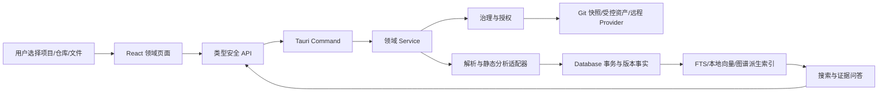

## 背景

本设计实现 [proposal.md](./proposal.md) 中的重构目标，行为契约由 `specs/*/spec.md` 定义。

当前工作区事实（2026-08-03 只读核对）：

- 应用为 Tauri 2 + React/TypeScript + Rust + rusqlite，知识链路已遵循 React → `src/lib/api/knowledge.ts` → `commands/knowledge.rs` → Service → Database 的总体方向。
- SQLite 当前 `SCHEMA_VERSION` 为 36，已存在项目、发布版本、来源、逻辑文档、文档版本、片段、关系、任务、Embedding Profile/向量、代码快照/文件/代码元素/关系和检索评测等表。
- 知识实现已膨胀为约 3.1 万行：`services/knowledge.rs` 约 8715 行、`database/knowledge.rs` 约 6010 行、`models/knowledge.rs` 约 1635 行、`commands/knowledge.rs` 约 905 行、`src/pages/knowledge/index.tsx` 约 5246 行、前端类型与 API 合计约 1959 行。
- 当前解析器仅原生覆盖 Markdown/MDX、TXT/LOG、JSON、YAML 和 SQL；Office、图片、HTML 原型及 PDF 尚未进入统一解析器注册链。
- 现有实现已经具备项目/版本、Git 工作区来源、源码快照、FTS、向量 Profile、关系召回和问答基础，不能以重写或清库替代迁移。
- 已观察到前后端字段漂移风险（例如来源保存缺失默认 `versionStrategy`）；新架构必须用显式 DTO、契约测试和兼容 Facade 固定 IPC 形状。
- 已有静态测试/构建证据不等同于本机知识闭环；本机真实文件解析、同步任务、索引可搜索、图谱证据、本地模型或可控测试 Provider 调用和带引用回答必须分别验收。
- 当前知识页面只用于盘点已经存在的业务能力、API 调用和数据状态；其 Tabs、页面层级、字段排列、配置步骤、文案、交互组件和测试快照均不构成新 UI 的设计依据或兼容契约。

本 change 与未归档的 `add-team-knowledge-base-rag` 有能力重叠。实施前先把其 109/120 个已完成任务映射到本 change，仅复用业务规则、数据层、API、基础设施和符合新流程的非 UI 测试；旧页面实现、交互组件与 UI 快照统一视为已替代。原 change 在迁移与验收完成前保持历史依据，不直接覆盖或删除。

## 目标与非目标

**目标：**

- 将超大知识模块拆成按变化原因组织的领域模块，保持数据库与 IPC 兼容窗口，同时以全新用户任务替换现有 UI 交互路径。
- 以项目、多个仓库和不可变版本清单作为所有文档、代码、图谱、向量和问答的共同作用域。
- 建立“原始资产 → 解析产物 → 逻辑文档 → 不可变版本 → 片段/索引 → 图谱/问答”的单向数据流。
- 把人工文档、上传文档和 AI 生成草稿纳入同一版本与审核模型。
- 保留本地优先、向量本地存储、远程默认关闭和证据可打开的安全边界。
- 用迁移、兼容 Facade、阶段开关和评测门禁实现可回滚的渐进交付。

**非目标：**

- 本 change 不建设中心化多人实时协作服务、服务器向量数据库或在线 Office 编辑器。
- 不把真实外部 AI、向量、视觉服务或生产环境接入作为本变更完成条件；相关协议、安全与失败路径通过本机回环测试服务验证。
- 不执行被分析仓库的代码、构建、测试、Hook、安装脚本或二进制。
- 不承诺首期精确解析所有旧版二进制 Office 特性、公式、宏、嵌入对象或任意扫描质量；必须暴露解析质量和缺口。
- 不让 AI 自动发布正式知识、自动确认关系或在无证据时补齐内部事实。
- 不在本 change 中删除旧 Command、旧表、旧索引或原 `add-team-knowledge-base-rag` 产物。
- 不对现有知识页面做渐进式美化、局部整理或交互复刻，也不把旧 UI 组件拆分后直接作为新工作台组件。
- 不把组件测试、静态检查或页面截图当作真实 Tauri/文件/模型/检索验收。

## 设计决策

### 1. 以领域模块替代单体 KnowledgeService，但保留兼容 Facade

后端目标依赖方向：

```text
commands/knowledge/*
  -> services/knowledge/{catalog,documents,ingestion,search,analysis,graph,qa,jobs,governance}
  -> database/knowledge/{catalog,documents,search,analysis,graph,jobs,migration}
  -> models/knowledge/*
```

跨域基础边界只包含稳定能力：`AssetStore`、`DocumentParser`、`EmbeddingProvider`、`GitSnapshotReader`、`KnowledgeEventPublisher`。旧 `KnowledgeService` 暂时成为 Facade，方法内部委托新服务；迁移完成后再单独提出移除。

前端按路由级工作台拆分：

```text
src/pages/knowledge/
  catalog/ documents/ search/ analysis/ graph/ qa/ jobs/ settings/
src/lib/api/knowledge/
src/types/knowledge/
src/store/knowledge/   # 仅保存筛选、选中项和面板状态
```

选择理由：现有大文件已同时承担来源、解析、同步、AI、代码、问答和 UI，继续追加会增加循环修改与审查成本。Facade 可在不一次性重写调用方的情况下逐域迁移。

替代方案：

- 一次性重写知识模块：边界最干净，但旧数据/API/测试回归面不可控，拒绝。
- 只把大文件机械拆成多个文件：不能解决职责和依赖问题，拒绝。
- 引入独立微服务：违背本地优先和当前部署边界，留作未来集中式知识平台评估。

### 2. 项目版本使用“多仓库不可变清单”

一个 `knowledge_project_version` 对应一份版本清单；清单为每个项目仓库保存：

- `repository_binding_id`
- `requested_ref_type` / `requested_ref_name`
- `resolved_commit_sha`
- `capture_kind`（tag/branch/commit/worktree）
- `dirty`、`captured_at`
- inclusion/exclusion 状态与原因

Tag/Commit 清单固化后不变；分支只是创建清单时的解析规则，后续移动不会改变旧清单。多仓库不要求同名 Tag，但任何缺失映射必须显式处理。

选择理由：微服务发布常由不同仓库、不同 Tag/分支组成，单个 `release.branch`/`commit_sha` 无法表达真实版本。

替代方案：

- 项目版本只保存一个 Tag 字符串：无法处理仓库差异，拒绝。
- 查询时实时读取各仓库 HEAD：不可复现历史，拒绝。

### 3. 原始资产、逻辑文档、草稿和提交版本分离

数据所有权：

```text
knowledge_assets              原始上传文件/受控复制、哈希、MIME、大小、存储键
knowledge_documents           稳定逻辑文档身份、标题、类型、项目、当前提交版本
knowledge_document_drafts     可变草稿、revision、base_version_id、编辑者
knowledge_document_versions   不可变提交/来源快照、内容、解析质量、父版本
knowledge_document_bindings   文档版本与项目版本/仓库快照绑定
knowledge_chunks              当前解析产物的结构化片段
```

原始资产存储在应用数据目录的内容寻址子目录，SQLite 保存存储键而非前端可见绝对路径；Markdown 手工文档正文直接作为版本内容，同时仍使用相同提交语义。恢复历史通过创建新版本实现。

选择理由：上传文件、人工编辑和来源同步的生命周期不同；将它们塞入单一可变 `content` 字段会破坏版本和审计。

替代方案：

- 每次编辑直接 UPDATE 当前版本：简单但历史不可核查，拒绝。
- 把大二进制 BLOB 全部放 SQLite：备份简单但数据库增长、迁移和流式读取成本高，首选受控文件存储；小型派生缩略图是否入库由 Spike 决定。

### 4. 文档接入采用受限解析器注册表

解析入口先做签名/MIME/扩展名、大小、压缩展开、路径和敏感检测，再选择解析器。统一输出：

- 规范化文本与语言
- 结构块（标题、段落、列表、表格、代码块、工作表、幻灯片、图片区域）
- 附件/资源引用
- parser id/version、质量等级、警告和失败原因
- 原始/规范化内容哈希

首期目标格式：

| 家族 | 首期处理 | 说明 |
|---|---|---|
| Markdown/文本/JSON/YAML/SQL/LOG | 复用并拆分现有解析器 | 保留结构与行号 |
| HTML/HTM | DOM 清洗后提取可见文本和控件标签 | 禁止脚本、网络加载与执行 |
| DOCX | 提取标题、段落、列表、表格、图片引用 | 不执行宏/外链 |
| XLSX | 按工作表提取单元格、表格和命名区域 | 公式保留表达式与可用缓存值，不求值 |
| PPTX | 按幻灯片提取文本、备注和图片引用 | 保留页码 |
| PDF | 首期支持文本层 | 扫描页进入 OCR 路径 |
| PNG/JPEG/WebP/GIF/SVG | 元数据与预览；可选 OCR/视觉描述 | SVG 清洗脚本与外链 |
| DOC/XLS/PPT | 受控转换适配器或明确不支持 | 禁止运行 Office 宏 |

解析器不直接写数据库；`IngestionService` 控制临时目录、限额、任务和事务批次。OCR 分为本地适配器与明确授权的远程视觉适配器，远程失败不自动降级到其他远程服务。

替代方案：

- 仅按扩展名调用解析库：易遭伪装文件与压缩炸弹，拒绝。
- 把所有格式转成 Markdown 后丢弃结构：实现快但表格/页码/证据定位损失，拒绝。

### 5. 标题/全文是基础检索，向量与图谱是可解释增强

查询管线：

```text
解析项目/版本/仓库/文档范围
  -> 权限与状态硬过滤
  -> title index + FTS5 并行
  -> 可选活动 Profile 向量召回
  -> 可选已确认关系有限扩展
  -> RRF/规则融合
  -> 稳定分页、命中通道和引用
```

标题建立独立规范化索引（可使用普通索引与 title FTS）；正文继续以结构片段进入 FTS5。搜索 API 将普通搜索与问答检索分开：普通搜索即使无模型也必须完整可用。

选择理由：版本号、路径、类名和标题依赖精确检索；向量适合同义表达但不可成为唯一入口。

替代方案：

- 所有查询统一调用向量模型：离线不可用、成本高且精确标识符效果差，拒绝。
- 只做 FTS5：无法充分覆盖自然语言同义问题，保留为降级而非最终问答方案。

### 6. AI 源码分析采用“静态证据 → 草稿 → 人工提交”

分析运行绑定项目版本清单和各仓库 Commit。步骤：

1. 通过 Git 对象读取 Tag/Commit，不 checkout；工作树单独标记 dirty。
2. 复用/增强静态分析提取文件、代码元素、API/IPC、SQL、配置和测试证据。
3. 确定性生成仓库/模块/接口/数据库/测试清单。
4. 在授权允许时，将选定证据发送给 AI 生成解释性草稿。
5. 校验引用，保存 `analysis_draft`，在 UI 中查看、编辑、比较。
6. 用户确认后以人工提交文档版本入库，保留 AI 原稿和编辑差异。

分析运行、AI 草稿、人工提交三者分别建模，避免“模型返回成功”直接等于“知识事实已发布”。

替代方案：

- AI 直接扫描仓库并写文档：权限、上下文和引用不可控，拒绝。
- 只输出确定性报表：可靠但不能满足项目分析叙述需求，作为 AI 不可用时的基础结果保留。

### 7. 图谱使用统一派生投影，来源关系仍是事实

现有 `knowledge_relations`、`knowledge_code_relations` 和来源实体关系继续保存事实；新增可重建的统一图谱节点/边投影：

```text
knowledge_graph_nodes(project_id, version_id, entity_type, entity_key, label, metadata_hash)
knowledge_graph_edges(project_id, version_id, from_node, relation_type, to_node,
                      evidence_ref, confidence, confirmed, source_relation_ref)
knowledge_graph_builds(profile/version/status/checkpoint)
```

图谱构建只消费已保存实体与关系，不成为原始事实唯一存储。查询默认只扩展已确认边，AI 建议边需要人工确认。跨版本演进边为显式关系，不通过同名自动合并。

选择理由：统一投影让 UI 与检索能跨文档/代码来源查询，同时保留来源表的专属字段和迁移稳定性。

替代方案：

- 直接让 UI 查询多个关系表并拼图：耦合高、难以稳定分页与版本过滤，拒绝。
- 引入 Neo4j/远程图数据库：扩大部署与权限范围，首期拒绝。

### 8. Embedding Profile 与向量继续本地事实存储

沿用现有 Profile 指纹与蓝绿生命周期，补充文档解析器/规范化版本和项目版本绑定。远程 Provider 只返回向量；所有向量和激活状态保存在本地。过滤后候选规模达到真实性能阈值前继续使用 SQLite + Rust 余弦扫描；ANN 必须是可重建派生索引。

选择理由：现有本地优先路径已形成，重构重点是契约和授权而非替换向量技术。

替代方案：

- 远程向量数据库：首期安全/运维范围过大，拒绝。
- 原地重建活动向量：失败会让问答不可用，继续拒绝。

### 9. 问答默认 evidence-only，非证据知识不得补齐项目事实

问答服务先调用统一 `KnowledgeSearchService`，再组装带稳定 citation id 的上下文。回答结构至少包含：范围、结论、实现证据、测试证据、缺口/冲突、引用。每个项目内部事实必须映射到引用；引用缺失、版本冲突或范围歧义时拒答或要求选择。

对话模型只从具备 chat 能力的 AI Provider 中选择；Embedding-only Provider 不进入问答下拉。远程聊天与远程 Embedding 分别授权。

替代方案：

- 允许模型常识补充内部事实：准确性不可审计，拒绝。
- 将所有检索结果全文发送模型：泄露与上下文膨胀风险高，拒绝。

### 10. 所有长任务进入持久化编排器

现有 `knowledge_jobs` 演进为统一任务 Facade，执行器按任务类型注册。任务 payload 只保存可重放引用和配置快照，不保存秘密。状态机：

```text
queued -> running -> completed
                  -> failed -> queued(retry)
                  -> cancelling -> cancelled
running + lost heartbeat -> interrupted -> queued(retry)
```

每个执行器定义幂等键、检查点、可取消边界、临时资源清理和结果完整性检查。数据库锁不跨网络/文件 await；每批短事务提交。

选择理由：现有同步/向量/源码任务已经分散出现，统一状态与恢复能减少重复轮询和虚假进度。

替代方案：

- 每个 Service 自建后台线程与状态：恢复、取消和 UI 映射会继续分裂，拒绝。

### 11. IPC 使用领域 DTO 与兼容适配，不再共享超大万能类型文件

每个 API 明确请求、响应、错误码、字段命名、可空性和枚举。Rust DTO 使用显式 serde 契约，TypeScript 分域镜像；兼容 Facade 对旧 payload 补充安全默认值并记录弃用审计，但不会吞掉缺失关键作用域。

新增 Command 组（名称在实现前通过契约表最终确认）：

- project/repository：列表、关联、解除、发现 refs、版本清单
- documents：创建草稿、保存、提交、上传、查询、比较、软删除/恢复
- search：普通搜索、命中解释、引用详情
- analysis：启动分析、查询草稿、保存编辑、确认入库
- graph：构建任务、子图查询、关系确认、证据详情
- qa：上下文预览、提问、引用打开
- jobs：列表、详情、取消、重试

选择理由：已发生 `versionStrategy` 之类字段漂移，必须把契约作为独立交付物和测试对象。

### 12. UI 采用项目上下文工作台、线性主流程与渐进式配置

新 UI 的交互事实来源依次为：本变更能力规格、已确认的普通用户任务、数据与权限约束。现有 `src/pages/knowledge/index.tsx` 只能用于核对功能是否遗漏和追踪 API，不得用于决定新页面的导航、信息架构、表单结构、按钮位置、操作顺序、文案或状态管理。

建议路由：

```text
/knowledge/projects
/knowledge/projects/:projectId/overview
/knowledge/projects/:projectId/repositories
/knowledge/projects/:projectId/versions
/knowledge/projects/:projectId/documents
/knowledge/projects/:projectId/search
/knowledge/projects/:projectId/analysis
/knowledge/projects/:projectId/graph
/knowledge/projects/:projectId/qa
/knowledge/jobs
/knowledge/settings
```

普通用户主流程固定为：

| 场景 | 默认线性流程 | 按需展开的高级内容 |
|---|---|---|
| 首次使用 | 创建项目 → 选择仓库 → 选择版本 → 确认并同步 | 仓库角色、逐仓库版本映射、排除规则 |
| 上传文档 | 选择文件 → 确认项目/版本 → 上传 | 可见范围、解析策略、跨版本共享 |
| 搜索 | 输入关键词 → 查看结果 → 打开证据 | 仓库、类型、来源、通道和状态筛选 |
| 版本配置 | 选择推荐 Tag/分支 → 确认映射 → 创建版本 | Commit SHA、逐仓库覆盖、缺失仓库处理 |
| 向量配置 | 选择“本地推荐”或“远程自定义” → 检查 → 保存 | 维度、前缀、归一化、分块和模型修订 |
| 项目问答 | 继承当前项目/版本 → 输入问题 → 查看回答与引用 | Provider、上下文预览、跨版本比较 |

默认路径每一步只显示当前决策必需的字段，使用已选项目/版本、检测结果和推荐值自动填充；技术参数、诊断信息和低频覆盖项放入默认折叠的“高级设置”或“查看详情”。用户返回上一步、关闭弹窗或遇到校验失败时保留未提交输入，最终提交前提供一页简短摘要。

页面只保存交互状态；后端实体按需查询。项目、版本与仓库筛选作为工作台上下文显式展示。新页面可以复用 Ant Design 基础组件、主题令牌、类型化 API 和通用错误处理，但不得导入旧知识页面的业务交互组件或复制其组合方式。创建/编辑使用 Ant Design Form/Modal 或 Drawer，长编辑器页面独立路由；危险删除、远程发送和发布分析必须二次确认。所有新下拉、单选、多选和菜单显示中文，内部 enum/API 值保持稳定。

用户可见文案使用业务语言和短句：主界面不直接暴露 `Profile`、`fingerprint`、`dimension`、`Commit SHA`、`checkpoint` 等内部术语；确需展示时先给出中文名称和处理建议，技术原文仅放在详情中。每个异步操作立即显示“正在做什么”，完成后显示结果和下一步，失败时显示原因与可执行操作，不展示长堆栈或仅返回错误码。

选择理由：当前 5200 行单页使所有状态和功能互相影响；仅按领域拆路由仍可能把后端复杂度直接暴露给用户。用项目上下文、线性主流程和渐进式展示，可同时降低认知负担、重渲染、测试和权限复杂度。

替代方案：

- 继续增加 Tabs：短期改动小，但状态、加载和可达性继续耦合，拒绝。
- 在现有知识页面上逐步整理字段和弹窗：能够减少改动，但会继续继承造成复杂与凌乱的交互假设，拒绝。
- 在单个长表单中展示全部字段：实现直接，但普通用户需要理解 Git、向量与解析器内部概念，配置错误率高，拒绝。
- 为每项设置都增加长篇说明：信息完整但主流程噪声过高，改为短标签、推荐默认值、按需帮助和技术详情。

### 13. 技术验证形成暂定依赖、索引、渲染与限额决策（待确认）

> 状态：**待确认**。以下结论只来自 2026-08-03 在 macOS arm64 的独立本机 Spike；没有连接生产环境或真实外部 AI 服务。正式锁定依赖前仍须完成本项目的 macOS 编译和安全检查。

| 领域 | 暂定方案 | 已验证依据 | 未通过时的功能表现 |
|---|---|---|---|
| DOCX/PPTX | `zip` 解包 + `quick-xml` 0.41.0 逐条目解析 | 合成 OOXML 成功提取中文文本；损坏压缩包被拒绝；不执行文档内容；0.39.4 经 RustSec 审计发现两项高危拒绝服务漏洞后已排除 | 保留原始资产，显示“该文件暂不能解析”，不进入索引 |
| XLSX | `calamine`，只读取单元格与公式缓存 | 中文工作表、内联字符串与公式缓存读取成功；不会求值公式 | 保留工作表和原始文件，提示未提取范围 |
| PDF 文本层 | `lopdf` 有界文本提取 | 合法 PDF 提取成功；损坏输入被拒绝；2 MiB 压缩内容在 1 MiB 上限处被拒绝 | 标记“需要 OCR”或“文本层不可用”，不虚构正文 |
| HTML | `ammonia` 白名单清洗，允许受控相对资源 | 脚本、事件属性、危险 URL 与外部资源被移除；超限 HTML 在解析前拒绝 | 仅保留可安全提取的纯文本或返回可操作的清洗失败 |
| SVG | `svg-hush`，默认不允许数据 URL | 脚本、事件属性、跨域 URL 被移除；畸形及超限 SVG 被拒绝 | 仅保存受控资产与预览失败状态，不内嵌执行 |
| 本地 OCR | 独立的 macOS Vision 适配器，默认按需启用 | 中文、版本号和接口路径夹具离线识别成功；实测约 216ms、最低候选置信度 0.30；最大 RSS 约 103MB | 无适配器时只保存图片元数据/预览并标记“未提取文本” |
| 远程视觉 | OpenAI 兼容的独立授权适配器 | 仅以 `127.0.0.1` 回环服务验证文本+图片请求与标准选择结果响应 | 不授权、超时或能力不符时拒绝发送，不自动切换远程服务 |
| 标题搜索 | 普通 B-tree 用于精确和前缀；独立 FTS5 trigram 用于包含 | 30,000 条混合中文/版本/路径/类名/路由夹具中，普通索引精确 p95 < 1μs、前缀 p95 65μs；包含查询普通表 p95 1,522μs、trigram p95 515μs | FTS 不可用时仍提供精确/前缀标题与正文搜索，并明确降级 |
| 图谱渲染 | 首期自定义 Canvas 默认渲染；SVG 只作小图/无障碍结构化补充 | 无新增前端依赖；独立浏览器原型中 Canvas 1k/5k 为 0.6ms/1.5ms，SVG 为 1.9ms/4.7ms；已验证焦点、方向键、缩放和证据选择 | 仅返回有限子图和可读关系列表，不一次性渲染全量图 |

直接依赖候选均为 MIT 或 Apache-2.0/MIT 双许可证。清洗候选的传递闭包还包含 MPL-2.0 与 Unicode 数据许可证；升级后的解析器与清洗器 Spike 锁文件均已通过 RustSec 审计。正式锁定后仍须以本项目锁文件再次复核许可证和漏洞状态。Spike 的 `target` 目录（81–129 MiB）属于编译工件，不能误作应用安装包体结论。

首期默认限额（均可由受管配置下调；超过即拒绝并说明原因）：

| 项目 | 默认值 | 目的 |
|---|---:|---|
| 单文件原始大小 | 20 MiB | 控制桌面内存与复制时间 |
| 单次批量 | 50 个文件、原始总量 100 MiB | 使失败能逐文件反馈和重试 |
| 容器条目数 | 2,000 | 覆盖正常 OOXML 条目，同时限制目录爆炸 |
| 容器展开总量 | 200 MiB | 防止压缩炸弹；实际读取时仍逐条计数 |
| 嵌套压缩容器 | 深度 1，默认拒绝内部 ZIP/OOXML 容器 | 避免递归解压攻击 |
| 单文件解析时间 | 30 秒 | 避免异常文件长时间占用任务 |
| 单项目受管资产 | 2 GiB，80% 预警 | 防止无提示占满本地磁盘 |
| 图谱默认/硬上限 | 1,000 / 5,000 节点 | 默认保持可理解，超限要求继续展开或筛选 |
| 查询页大小与目标 | 50 条；标题/全文本机 p95 分别不高于 50ms/100ms | 为后续评测与回滚提供门槛 |

以上限额的本机夹具已经覆盖 50 条目批量通过、超条目、超展开大小与嵌套容器拒绝。它们不是永久容量承诺；在实际项目语料的本机评测完成后，可通过新的评审更新数值，但不得放宽路径、解压、超时和授权边界。

### 14. 安全控制位于 Rust 信任边界并覆盖四个阶段

1. 读取：授权根、canonical path、符号链接、文件签名、ZIP 限额、Git 只读参数白名单。
2. 落盘：内容寻址资产、原子复制、权限、敏感检测、内部路径脱敏、临时文件清理。
3. 远程：Provider 能力、HTTPS/host 策略、系统/来源/文档四层授权、发送预览、超时与响应上限。
4. 输出：搜索、问答、图谱、MCP、导出和审计再次执行范围/敏感过滤。

前端选择文件只负责用户意图；Rust 再校验并复制到受控存储。Office/HTML/SVG 解析不得执行宏、脚本或加载远程资源。凭据只通过 Safe Credentials 引用。

### 15. 当前 schema v36 采用追加迁移、回填任务和阶段开关

实现时先重新读取最新 `SCHEMA_VERSION` 并预留连续迁移号；不得假设仍是 36。迁移分三类：

1. 小型结构 DDL：项目仓库绑定、项目版本清单、资产、草稿、版本绑定、分析运行。
2. 大型派生回填：标题索引、图谱投影、解析元数据，通过后台任务和检查点执行。
3. 兼容收口：旧 Facade 读新表，旧写接口映射到新事务；验证稳定后再停止双路径。

数据库启动迁移只完成必须原子完成的小型结构，不在启动时解析 Office、重建向量或构图。派生回填失败不会阻止旧搜索入口。

替代方案：

- 在单个启动事务中完成全部回填：大库启动时间和失败恢复不可控，拒绝。
- 复制到新数据库再整体切换：回滚清晰但双库一致性和磁盘成本高，暂不采用。

### 16. 以本机分层证据控制发布，而不是用“构建通过”代表完成

每个阶段分别记录：

- 静态：格式化、类型、lint、`git diff --check`
- 单元/契约：解析器、DTO、Service、检索融合、引用校验
- 数据库：空库、v36/最新旧库升级、失败重试、约束与真实数据格式
- IPC：桌面 Command 与浏览器 Dev API 对等、错误/默认字段回归
- 浏览器：Control Chrome/Codex 内置浏览器验证真实交互、控制台、空/错/成功态
- 本机端到端：本机 Git 多仓库、Markdown/Office/图片/HTML、任务、索引、图谱、本地向量、可控测试 Provider 与带引用回答
- 远程协议：使用本机回环测试服务验证授权、能力发现、限流、超时、重定向、响应上限和敏感内容阻断，不连接真实外部服务
- 目标平台：macOS 解析器、ONNX/OCR/Office 依赖和打包
- 安全/性能：越界拒绝、秘密不泄露、压缩炸弹、响应上限、规模 P50/P95

阶段门禁和评测运行保存在本地，UI 不得将未完成项显示为“已验收”。

## 数据流



## 文件影响范围

| 现有位置 | 目标职责变化 |
|---|---|
| `src-tauri/src/commands/knowledge.rs` | 保留兼容导出，按 catalog/documents/search/analysis/graph/qa/jobs 拆分薄 Command |
| `src-tauri/src/services/knowledge.rs` | 缩为 Facade，业务迁入分域 Service；Git/文件/网络 await 与 DB 事务分离 |
| `src-tauri/src/database/knowledge.rs` | 按表族拆 DAO/事务；增加资产、草稿、绑定、图谱、分析与迁移查询 |
| `src-tauri/src/models/knowledge.rs` | 拆分领域模型与 IPC DTO，固定 serde/TS 契约 |
| `src-tauri/src/services/knowledge_parser.rs` | 演进为解析器注册表，新增 HTML/Office/PDF/图片适配器与质量协议 |
| `src-tauri/src/services/knowledge_embedding.rs` | 保留 Profile/蓝绿能力，改接统一文档版本与任务编排 |
| `src-tauri/src/services/knowledge_retrieval.rs` | 复用融合算法，接入标题通道、统一图谱投影和稳定分页 |
| `src-tauri/src/services/knowledge_policy.rs` | 扩展资产、OCR/视觉、HTML/Office 与输出阶段策略 |
| `src-tauri/src/database/schema.rs` | 追加连续迁移与旧库升级测试，不重写历史迁移 |
| `src-tauri/src/lib.rs` | 注册新分域 Command，兼容旧 Command |
| `src/pages/knowledge/index.tsx` | 变为入口壳或隔离的旧版回滚壳；新项目上下文页面从已确认用户流程重新实现，不从该文件拆出交互组件复用 |
| `src/lib/api/knowledge.ts` | 变为稳定聚合出口，按领域拆 API 与契约测试 |
| `src/types/knowledge.ts` | 变为聚合出口，分域类型并逐字段对齐 Rust |
| `src/store/knowledge.ts` | 仅管理项目/版本选择、筛选和布局，不缓存后端事实 |
| `src/Router.tsx`、`Sidebar.tsx` | 增加知识子路由与中文导航，保持 `/knowledge` 可达 |
| `src-tauri/tests/`、`src/pages/knowledge/*.test.tsx` | 拆分跨域回归、真实 fixture 与迁移/IPC/页面测试 |

## 风险与权衡

- [当前知识代码和 schema 有其他会话未提交改动] → 实施前按单文件占用协议重新核对，逐域小步迁移，不覆盖现有 WIP。
- [新 change 与旧 `add-team-knowledge-base-rag` 重叠] → 先建能力/任务映射，仅复用业务规则、数据、API、基础设施和符合新流程的测试；旧 UI 实现与交互测试不得标记复用。
- [Office/PDF/OCR 依赖增大包体或导致 macOS 构建失败] → 先做依赖 Spike；解析器可选注册，缺失时返回明确能力状态，不能让应用无法启动。
- [恶意 Office/HTML/SVG 或压缩炸弹耗尽资源] → 文件签名、条目/大小/时间/内存上限、脚本/外链禁用、隔离临时目录和取消机制。
- [应用数据目录资产增长] → 内容寻址去重、项目配额、可见清理预览和引用计数；永久清理必须单独确认。
- [多仓库版本配置复杂] → 提供默认同名 Tag 批量映射和逐仓覆盖，缺失仓库必须显式处理并显示完整度。
- [功能完整但普通用户难以完成配置] → 主流程按固定步骤推进、默认值自动填充、高级设置折叠、文案使用业务语言，并以普通用户任务完成率进行浏览器验收。
- [实施时为了省事重新沿用旧 UI] → 明确旧页面只可用于功能/API 清单；新路由禁止导入旧业务交互组件，代码审查和浏览器验收均以新用户流程为准。
- [模块拆分期间 Facade 与新 API 双路径漂移] → 每个旧接口配置契约测试与单一委托路径，禁止复制业务逻辑。
- [大库图谱/标题索引回填阻塞启动] → 仅 DDL 在启动迁移，派生数据后台构建并保留旧入口。
- [SQLite 单连接成为并发瓶颈] → 网络/解析不持锁，短事务、批处理、WAL/busy timeout 按现状；以真实 P95 决定是否调整连接模型。
- [AI 文档被误当事实] → 草稿状态、事实/解释分区、引用校验、人工提交和审计为强制门禁。
- [本地模型/向量不可用导致搜索不可用] → 标题与 FTS 独立可用，模型失败不自动远程降级。
- [历史版本串用] → 多仓库清单硬过滤、版本化节点/引用、评测中的版本串用率和拒答用例。
- [远程模型泄露内部代码] → 系统/来源/文档/内容四层授权、上下文预览、最小片段、Safe Credentials 和脱敏审计。

## 迁移计划

1. **基线冻结与映射**
   - 重新读取最新 worktree、schema、OpenSpec 和测试；记录旧 change 120 项任务到新 14 个能力的复用/缺口映射。
   - 为现有 Command/DTO、v36 数据和 `/knowledge` 功能可达性建立回归基线；不记录或继承旧 UI 的布局、步骤与组件行为基线。
2. **建立分域骨架与兼容 Facade**
   - 拆 models/API/types 的公共契约，再按 catalog/documents/jobs 迁移最低风险逻辑。
   - 旧导出只委托新模块；每移动一个职责就运行聚焦测试和格式化。
3. **追加核心 schema 与资产/文档版本闭环**
   - 迁移项目仓库绑定、多仓库版本清单、资产、草稿和版本绑定。
   - 交付手工文档新增/编辑/提交/比较/软删除/恢复以及 Markdown/文本上传。
4. **异构解析闭环**
   - 依次接 HTML、DOCX、XLSX、PPTX、PDF 文本层、图片元数据，再按 Spike 接本地 OCR；远程视觉协议通过本机回环测试服务验证。
   - 每个格式有真实 fixture、损坏/超限/越界测试和页面结果。
5. **标题/全文搜索与稳定分页**
   - 建标题索引和回填任务，统一筛选与引用；保持现有 FTS 路径可回滚。
6. **多仓库版本与 AI 分析审核**
   - 交付版本清单、快照完整度、静态证据、AI 草稿、编辑和人工提交。
7. **图谱投影**
   - 从现有关系表构建首个版本化投影，提供有限子图、证据详情和人工关系确认。
8. **向量与证据问答收口**
   - 将现有 Profile/本地向量接到新文档版本；通过本机模型或测试 Provider 完成远程授权协议、上下文预览、引用校验和拒答。
9. **可观测门禁与阶段开放**
   - 使用本机仓库、真实文件夹具、本地向量和测试 Provider 运行多仓库、各格式、版本隔离、图谱、向量和问答评测；逐阶段打开新入口。
10. **兼容收口**
    - 新 UI 通过门禁后成为 `/knowledge` 唯一正常入口；旧 UI 仅可在隔离回滚开关后短期保留，其代码清理与旧 Facade/冗余派生索引移除另行处理。

回滚策略：

- 数据库只前向迁移，不尝试降级 `user_version`；必要时可通过独立功能开关临时恢复旧 Facade 和隔离旧页面，但旧页面不参与新 UI 设计或验收。
- 原始资产、逻辑文档和不可变版本永不因派生索引失败删除。
- 标题、FTS、向量和图谱采用旧活动索引/投影继续服务，新构建失败仅标记失败。
- 新 Parser 可逐个禁用；未解析资产仍保留并显示能力不足。
- 远程处理可全局关闭，不影响本地标题/全文检索。

## 规格确认索引

以下 14 份规格即本次需要逐项确认的实现文档；未确认前状态均为 Proposed：

| # | 规格文档 | 需要确认的核心默认方案 |
|---|---|---|
| 1 | `project-repository-catalog` | 一个项目可绑定多个已登记 Git 工作区，解除关联保留历史 |
| 2 | `document-ingestion-pipeline` | 原生 OOXML/HTML/PDF 文本/图片元数据，旧 Office 与 OCR 走受控适配器 |
| 3 | `managed-document-lifecycle` | 草稿/上传统一 CRUD，普通删除软删除，永久删除单独授权 |
| 4 | `knowledge-search` | 标题与全文为基础能力，向量/图谱不可用时安全降级 |
| 5 | `ai-code-analysis` | 静态证据先行，AI 只产草稿，人工编辑确认后入库 |
| 6 | `project-version-governance` | 项目版本是多仓库 Commit 清单，分支每次采集固化 Commit |
| 7 | `custom-document-versioning` | 已提交版本不可变，恢复通过创建新版本，未绑定不归入最新版本 |
| 8 | `knowledge-graph` | 来源关系为事实、统一图谱为可重建投影、AI 边默认未确认 |
| 9 | `embedding-index-management` | 本地/远程均可，向量始终本地保存，蓝绿切换且不自动远程降级 |
| 10 | `evidence-grounded-qa` | 默认 evidence-only，项目/版本硬过滤，引用不足明确拒答 |
| 11 | `knowledge-job-orchestration` | 所有长任务持久化、幂等、可取消/恢复/重试 |
| 12 | `knowledge-security-governance` | Git 只读、路径/远程四层授权、Safe Credentials、MCP 默认只读 |
| 13 | `knowledge-migration-compatibility` | 从当前 v36 追加迁移，保留旧 API Facade 与阶段回滚，不清库 |
| 14 | `knowledge-observability-evaluation` | 本地检查与真实验收分开，质量/性能门禁决定阶段开放 |

## 待确认的开放问题

- Office/PDF 解析最终采用哪些 Rust crate 或隔离辅助进程，需要完成 macOS 编译、许可证、包体、内存和恶意文件 Fixture Spike 后决定；这不改变支持格式与失败可见性契约。
- 图片首期默认 OCR 模型、语言包和离线资源大小，需要用真实中文原型截图评测；未选择前仍可完成资产、预览和“未提取文本”状态。
- 标题 FTS 使用现有 tokenizer 的独立表还是普通规范化列 + 前缀索引，需要对中文标题、版本号和路径样本做查询计划与 P95 对比。
- 图谱前端采用 SVG/Canvas 方案和具体依赖，需要按 1k/5k 节点子图的交互性能、包体和可访问性 Spike 决定；后端有限子图契约不变。
- 本地资产默认项目配额、单文件上限、压缩展开倍率、图谱节点上限和评测阈值需根据目标团队真实语料规模校准，实施前写入配置并在 UI 显示。
